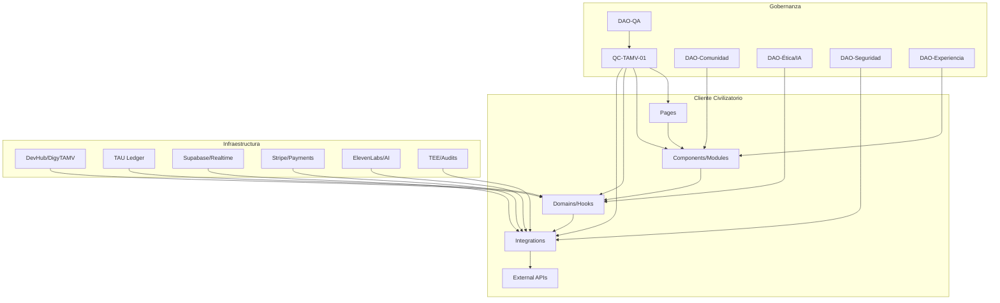

# Plan Quirúrgico Modular del TAMV MD-X4
## Versión Final Optimizada - QC-TAMV-01 v1.1

***

## 0. Vista General del Plan

Módulos de trabajo en orden de implementación:

1. QA Constitucional y Guardian de Código  
2. Social + Tiempo Real + Chat  
3. Isabella Prime (LLM+TTS)  
4. DreamSpaces/HyperReal  
5. Marketplace/Stripe/TAU  
6. Content Sync + DigyTAMV  
7. NOTITAMV + Gifts  
8. Paleta/Visual  

En paralelo:
- Integración de LAAS/DAOs híbridas (gobernanza, no dinero)
- Inventario DevHub gestionado por DigyTAMV
- Lista de documentación faltante
- Auditoría TEE en la secuencia

***

## 1. Módulo QA Constitucional (QC-TAMV-01)

### Estado Actual
✅ **Implementado**: ESLint Plugin, scripts de check-architecture, tests básicos
✅ **Documentado**: QC-TAMV-01 v1.1.md

### Acciones pendientes
- [ ] Activar eslint-plugin-tamv con reglas en modo `error`
- [ ] Añadir mini-suite Playwright/Vitest base (login, home, Isabella)
- [ ] Integrar `npm run check:architecture` en CI/CD

### Pruebas de Calidad
- `npm run lint` sin errores
- `npm run check` (TS) sin errores
- `npm run test` (Vitest) sin fallos
- `npm run test:e2e` (Playwright) para `/`, `/login`, `/isabella`
- `npm run check:architecture` sin violaciones

### DAOs Híbridas
**DAO-QA (Cámara Técnica)** puede:
- Aprobar/ajustar reglas QC (lint, check-architecture)
- Definir umbrales de cobertura tests
- Votar excepciones **no económicas**
- No puede: Cambiar lógica de Stripe, ledger TAU/MSR, comisiones

***

## 2. Social Core + Presencia

### Estado Actual
✅ **Componentes existentes**: UnifiedSocialFeed, SocialFeedPost, CreatePostComposer
✅ **Integración**: Supabase client available

### Acciones pendientes
- [ ] Crear hooks `useSocialFeed`, `useCreatePost`, `useUserPresence`
- [ ] Conectar a Supabase RLS + realtime
- [ ] Reemplazar dummy data por queries reales
- [ ] Añadir eventos a `analytics_events` / BookPI

### Pruebas de Calidad
- Unit tests (Vitest):
  - `useSocialFeed` devuelve posts ordenados y paginados
  - `useCreatePost` escribe en BD y actualiza feed
- E2E:
  - Usuario test se loguea, crea post, lo ve en feed, otro usuario lo ve vía realtime
- Performance:
  - Tiempo de carga feed inicial < 300–500 ms

### DAOs Híbridas
**DAO-Comunidad** puede:
- Proponer políticas de visibilidad, reputación, moderación
- Decidir parámetros de presencia (ej. mostrar/ocultar estados)
- No controla monetización de acciones

***

## 3. WebSocket Unificado + Chat TAMV

### Estado Actual
✅ **Hook existente**: useWebSocket
✅ **Componentes existentes**: IsabellaChat

### Acciones pendientes
- [ ] Extender `useWebSocket` a tipos: `gift_event`, `chat_message`, `presence_update`
- [ ] Crear `TAMVChatDock` (dock flotante) que consume un solo WS global
- [ ] Optimizar reconexión y re‑uso de conexión

### Pruebas de Calidad
- Unit tests:
  - `useWebSocket` mantiene una sola instancia, re‑usa conexión
  - Reconexión controlada
- E2E:
  - Chat 1:1: usuario A manda mensaje, usuario B lo recibe casi en tiempo real
  - Gifts siguen funcionando sobre el mismo socket
- Latencia:
  - RTT medio WS < 150–200 ms para chat

### DAOs Híbridas
**DAO-Relacional** puede:
- Definir normas de uso de chat (moderación, privacidad, UX)
- No controla costes de infraestructura WS ni tarifas asociadas

***

## 4. Isabella Prime (LLM+TTS)

### Estado Actual
✅ **Hook existente**: useIsabellaVoice
✅ **Integración**: ElevenLabs API disponible

### Acciones pendientes
- [ ] Reescribir sincronización a nivel **chunk/frase**, no palabra
- [ ] Añadir cache TTS (hash texto+voz → audio) en BD/storage
- [ ] Implementar timeouts y fallback texto‑solo
- [ ] Confirmar despliegue como Edge Functions en región cercana

### Pruebas de Calidad
- Unit tests:
  - Dado un texto largo, se generan N chunks sin errores de índices
  - Cache hit → no llama a ElevenLabs
- E2E:
  - Prompt corto responde < 3–4 s con audio
  - Si TTS falla, hay respuesta en texto sin crash
- Métrica:
  - P95 de respuesta Isabella < ~4–5 s (chat+audio)

### DAOs Híbridas
**DAO-Ética/IA** puede:
- Definir límites de contexto, tipos de respuestas, política de logs
- Auditar prompts del sistema
- No toca parámetros económicos

***

## 5. DreamSpaces + HyperRealEngine

### Estado Actual
✅ **Componentes existentes**: DreamSpaceViewer, HyperRealEngine
✅ **Tecnología**: React Three Fiber + Three.js

### Acciones pendientes
- [ ] Code-splitting por ruta; cargar solo cuando se accede a la ruta XR
- [ ] Optimizar escenas (LOD, reducción de polycount/texturas)
- [ ] Throttling de audio-reactivo

### Pruebas de Calidad
- E2E:
  - Transición del feed a DreamSpaces en < 2 s percibidos
- Performance test:
  - FPS ≥ 45–60 en equipos medios; sin stutters prolongados
- Unit tests básicos:
  - Componentes 3D no crean memory/leaks evidentes

### DAOs Híbridas
**DAO-Experiencia** puede:
- Definir límites de intensidad visual/sonora, accesibilidad
- Votar qué tipos de experiencias XR se permiten por defecto
- No decide precios de acceso

***

## 6. Marketplace, Stripe y TAU

### Estado Actual
✅ **Componentes existentes**: StripeCheckout
✅ **Functions**: create-checkout, stripe-webhook (Supabase Edge Functions)

### Acciones pendientes
- [ ] Validar `create-checkout` + `stripe-webhook` de punta a punta en modo test
- [ ] Conectar TAU a features (gifts premium, entradas especiales, etc.)
- [ ] Asegurar que webhook es ligero y jobs pesados van a cola

### Pruebas de Calidad
- Tests manuales + script:
  - Crear N compras test → verificar `transactions`, `tcep_wallets` actualizados
- E2E automatizado:
  - Flujo (simulado) compra → wallet → consumo de TAU (p. ej., gift premium)
- Robustez:
  - Reintento de webhooks idempotente; Stripe no genera duplicados

### DAOs Híbridas
**Restricción**: DAOs sin poder en economía
- DAOs pueden:
  - Opinar sobre tipos de productos permitidos
- No pueden:
  - Decidir comisiones, reparto de TAU, cambio de precios o ARPU

***

## 7. Content Sync + DigyTAMV + DevHub

### Estado Actual
✅ **Estructura inicial**: pages/Docs.tsx

### Acciones pendientes
- [ ] Implementar Content Sync con clasificación por tipo (`doc_tech`, `marketing`, `blueprint`, `deprecated`)
- [ ] Añadir campo `module_target` (ej. `social`, `isabella`, `xr`, `economy`)
- [ ] Cargar esto en DigyTAMV para que cualquier IA/Dev pueda navegar la "memoria"
- [ ] Crear inventario DevHub completo con categorías:
  - APIs (TAMV OS, TAMV AI, MSR/BookPI, XR)
  - SDKs y ejemplos
  - Módulos del cliente civilizatorio
  - Normas (QC-TAMV, política de datos, etc)
  - ADRs y blueprints

### Pruebas de Calidad
- Scripts que verifican:
  - Todos los endpoints expuestos en código tienen entrada en DevHub
  - No hay docs huérfanos (sin código asociado)
- E2E:
  - Desde DevHub, abrir una API (ej. TAMV AI) y probar un ejemplo directo

### DAOs Híbridas
**DAO-Documentación** puede:
- Aprobar cambios en docs normativas, etiquetar deprecated, decidir visibilidad
- No altera contrato técnico si QA/arquitectura lo bloquean

***

## 8. NOTITAMV + Gifts

### Estado Actual
✅ **Componentes existentes**: NotificationCenter, NotificationToast, CircleGiftGallery
✅ **Hook existente**: useNotifications

### Acciones pendientes
- [ ] Stress-test interno con generación de eventos a alta frecuencia
- [ ] Ajustar límites (máx notificaciones visibles, colas)
- [ ] Degradación en dispositivos débiles

### Pruebas de Calidad
- Medir CPU/FPS bajo carga
- E2E:
  - Recibir notificación y gift sin congelar UI

***

## 9. Auditoría TEE (Trusted Execution)

### Estado Actual
❌ **No implementado**

### Acciones pendientes
- [ ] Integrar auditoría TEE en el orden de ejecución
- [ ] Identificar módulos sensibles para TEE: Isabella, Stripe, MSR, BookPI
- [ ] Implementar procedimiento de auditoría TEE:
  - Paso 1: Aislamiento de código en TEE
  - Paso 2: Ejecución de tests en TEE
  - Paso 3: Publicación de attestation
  - Paso 4: Monitoreo continuo

### DAOs Híbridas
**DAO-Seguridad** puede:
- Decidir qué módulos exigen ejecución en TEE
- Definir frecuencia de auditorías
- No controla claves raíz ni decisiones económicas

***

## 10. Documentación Faltante

### Lista Mínima para Completar

1. **QC-TAMV-01 en devhub/digy** (ya redactado, hay que integrar)
2. **Manual Social & Tiempo Real**:
   - Diseño de `useSocialFeed`, `useUserPresence`, WS unificado
3. **Isabella Prime Spec**:
   - Protocolo chunks, cache TTS, límites de latencia
4. **XR Performance Guidelines**:
   - Patrones permitidos en DreamSpaces/HyperReal (LOD, FPS, límites)
5. **Marketplace & TAU Spec**:
   - Flujos exactos compra → wallet → consumo, idempotencia
6. **Content Sync & DigyTAMV Spec**:
   - Cómo se clasifica contenido, cómo se refleja en DevHub
7. **TEE Audit Runbook**:
   - Pasos operativos concretos para correr auditorías TEE

### Requisitos de Documentación
Cada documento debe tener:
- Ubicación en repositorio (`02_MODULOS/.../INTERNO/LEGAL/PUBLICO`)
- Estado (draft, stable)
- Enlace en DigyTAMV/DevHub

***

## 11. Pipeline de Despliegue CI/CD

### Pipeline Obligatorio para PR hacia Ramas Protegidas

1. `npm run lint` - No errores
2. `npm run check` - TypeScript sin emit
3. `npm run test` - Vitest sin fallos
4. `npm run test:e2e` - Playwright para rutas críticas
5. `npm run check:architecture` - Script de grafo sin violaciones

Cualquier fallo ⇒ Merge bloqueado, Despliegue bloqueado

***

## 12. Diagrama de Arquitectura (Mermaid)

***

## 13. Referencias Técnicas

- [QC-TAMV-01 v1.1](02_MODULOS/M05_IA_TAMVAI/INTERNO/QC-TAMV-01-v1.1.md)
- [ArXiv: DAOs Híbridas](https://arxiv.org/html/2410.21593v1)
- [ArXiv: Auditoría TEE](https://arxiv.org/pdf/2506.23706.pdf)
- [Supabase Realtime](https://supabase.com/docs/guides/realtime)
- [ElevenLabs API](https://developers.elevenlabs.io/reference)
- [Stripe Webhooks](https://hookdeck.com/webhooks/platforms/guide-to-stripe-webhooks-features-and-best-practices)

***

## 14. Estado del Proyecto

| Módulo | Estado | Wiki Doc |
|--------|--------|---------|
| QA Constitucional | ✅ Implementado | `02_MODULOS/M01_QC/INTERNO/QC-TAMV-01-v1.1.md` |
| Social Core + Presencia | ✅ Hooks+Schema documentados | `docs/05_social_core_schema_ui.md` |
| WebSocket Unificado + Chat | ⚠️ En progreso | `02_MODULOS/M02_SOCIAL/INTERNO/MANUAL-SOCIAL.md` |
| Isabella Prime | ✅ Implementado | `02_MODULOS/M05_IA_TAMVAI/INTERNO/ISABELLA-PRIME-SPEC.md` |
| DreamSpaces/HyperReal | ✅ Implementado | `02_MODULOS/M03_XR/INTERNO/XR-PERFORMANCE-GUIDELINES.md` |
| Marketplace/Stripe/TAU | ✅ Implementado | `02_MODULOS/M04_ECONOMIA/INTERNO/MARKETPLACE-TAU-SPEC.md` |
| Auth & Memberships | ✅ Documentado | `docs/04_auth_memberships_access_control.md` |
| Federated Certification | ✅ Documentado | `docs/06_federated_certification.md` |
| Deployment Templates | ✅ Documentado | `docs/deployment_templates.md` |
| Content Sync + DigyTAMV | ⚠️ Spec escrita | `02_MODULOS/M06_CONTENT/INTERNO/CONTENT-SYNC-SPEC.md` |
| NOTITAMV + Gifts | ✅ Implementado | — |
| Paleta/Visual | ✅ Implementado | — |
| Auditoría TEE | ⚠️ Runbook escrito | `02_MODULOS/M01_QC/INTERNO/TEE-AUDIT-RUNBOOK.md` |

***

## 15. Responsabilidades y Roles

- **Lead QA**: Responsable de QC-TAMV-01, CI/CD
- **Developer Social**: Hook social, integración Supabase
- **Developer AI**: Isabella Prime, TTS, chat
- **Developer XR**: DreamSpaces, HyperRealEngine
- **Developer Economy**: Marketplace, Stripe, TAU
- **DAO Coordinator**: Integración DAOs, gobernanza
- **Documentalist**: Content Sync, DigyTAMV, DevHub