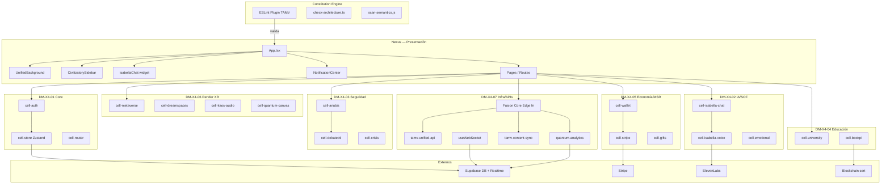

# 02 — Arquitectura TAMV MD-X4

> **Estado:** `stable` · **Versión:** 2.0 · **Origen:** Master Canon TAMV + análisis local 2026-02-24

---

## 1. Visión general

TAMV MD-X4™ es el núcleo operativo civilizatorio que unifica 177 repositorios federados en un solo core funcional. Se compone de seis capas arquitectónicas:

| Capa | Nombre canónico | Responsabilidad |
|------|----------------|-----------------|
| 0 | **Constitution Engine** | Reglas invariantes, lint, QC-TAMV-01 |
| 1 | **DM-X4 Domains** | Dominios de negocio (7 dominios base) |
| 2 | **Cells** | Módulos funcionales autónomos dentro de cada dominio |
| 3 | **MSR** | Motor de estado, reglas y rutas (State · Rules · Routes) |
| 4 | **Fusion Core** | Orquestador de integración y federación |
| 5 | **Nexus** | Capa de presentación y experiencia inmersiva |

---

## 2. Vista C4 L1 — Contexto

```
┌───────────────────────────────────────────────────────────────────┐
│                       TAMV Digital Nexus                          │
│                                                                   │
│  Usuario Final ──► Nexus UI  ──► Fusion Core ──► Dominios DM-X4  │
│  Operador TAMV ──► Admin     ──► Fusion Core ──► Dominios DM-X4  │
│                                                                   │
│  Externos: Stripe · ElevenLabs · Supabase · GitHub · Blockchain   │
└───────────────────────────────────────────────────────────────────┘
```

---

## 3. Vista C4 L2 — Contenedores

| Contenedor | Tecnología | Ruta en repo | Estado |
|------------|-----------|--------------|--------|
| Frontend inmersivo | React 18 + Vite + TS | `src/` | stable |
| Edge APIs | Supabase Edge Functions (Deno) | `supabase/functions/` | beta |
| Base de datos | PostgreSQL via Supabase | Supabase cloud | stable |
| Documentación canónica | Markdown governance | `docs/` | stable |
| Constitution Engine | ESLint plugin + scripts | `eslint-plugin-tamv/` + `scripts/` | stable |

---

## 4. Vista C4 L3 — Dominios DM-X4 y sus Cells

### DM-X4-01 · CORE/PLATAFORMA
**Responsabilidad:** shell app, navegación, estado global, autenticación.

| Cell | Artefacto | Ruta |
|------|-----------|------|
| `cell-router` | `App.tsx` + `BrowserRouter` routes | `src/App.tsx` |
| `cell-sidebar` | `CivilizatorySidebar` | `src/components/CivilizatorySidebar.tsx` |
| `cell-auth` | `Auth`, `useAuth`, Supabase auth | `src/pages/Auth.tsx`, `src/hooks/useAuth.ts` |
| `cell-onboarding` | `Onboarding` | `src/pages/Onboarding.tsx` |
| `cell-store` | Zustand global `useTAMVStore` | `src/stores/tamvStore.ts` |
| `cell-background` | `UnifiedBackground` | `src/components/UnifiedBackground.tsx` |

**MSR:**
- State: `user`, `isAuthenticated`, `isLoading`, `sidebarOpen`, `theme`
- Rules: usuario autenticado requerido para rutas protegidas
- Routes: `/`, `/dashboard`, `/auth`, `/onboarding`, `/profile`

---

### DM-X4-02 · IA/ISABELLA/THE SOF
**Responsabilidad:** chat IA, TTS, análisis emocional, orquestación multiagente.

| Cell | Artefacto | Ruta |
|------|-----------|------|
| `cell-isabella-chat` | `IsabellaChat`, `useIsabellaChatQuantum` | `src/components/IsabellaChat.tsx`, `src/hooks/useIsabellaChatQuantum.ts` |
| `cell-isabella-voice` | `useIsabellaVoice`, Edge fn `isabella-tts` | `src/hooks/useIsabellaVoice.ts`, `supabase/functions/isabella-tts/` |
| `cell-emotional` | `useIsabellaEmotionalAnalysis`, `useEmotionalDetection` | `src/hooks/useIsabellaEmotionalAnalysis.ts` |
| `cell-isabella-page` | `Isabella` page | `src/pages/Isabella.tsx` |
| `cell-sof-core` | THE SOF — Shadow Engine (conceptual, ref. `tamv-fusion-core`) | `supabase/functions/tamv-fusion-core/` |

**MSR:**
- State: `chatMessages`, `chatLoading`, `chatEmotion`
- Rules: chunk-by-phrase sync, TTS cache hit → no ElevenLabs call, timeout + text fallback
- Routes: `/isabella`

**Edge Functions:**
- `isabella-chat` — LLM conversation
- `isabella-chat-enhanced` — multiagent enhanced
- `isabella-tts` — ElevenLabs TTS proxy + cache

---

### DM-X4-03 · SEGURIDAD/GUARDIANÍAS
**Responsabilidad:** detección de amenazas, protección post-quantum, identidad.

| Cell | Artefacto | Ruta |
|------|-----------|------|
| `cell-anubis` | `AnubisSecuritySystem`, `Anubis` page | `src/systems/AnubisSecuritySystem.ts`, `src/pages/Anubis.tsx` |
| `cell-dekateotl` | Edge fns `dekateotl-security*` | `supabase/functions/dekateotl-security/`, `supabase/functions/dekateotl-security-enhanced/` |
| `cell-crisis` | `Crisis` page | `src/pages/Crisis.tsx`, `src/components/crisis/` |
| `cell-federation-security` | `FederationSystem` (ANUBIS, HORUS guardianías) | `src/systems/FederationSystem.ts` |

**MSR:**
- State: `SecurityMetrics`, `SecurityEvent[]`, `UserSecurityProfile`
- Rules: DEKATEOTL 11-layer scan, threat level escalation, self-healing
- Routes: `/anubis`, `/crisis`

**Edge Functions:**
- `dekateotl-security` — 11-layer security scan
- `dekateotl-security-enhanced` — advanced behavioral analysis

---

### DM-X4-04 · UTAMV/BOOKPI/TAMV ONLINE
**Responsabilidad:** campus educativo, journeys, certificaciones blockchain.

| Cell | Artefacto | Ruta |
|------|-----------|------|
| `cell-university` | `UniversitySystem`, `University` page | `src/systems/UniversitySystem.ts`, `src/pages/University.tsx` |
| `cell-bookpi` | `BookPI` page | `src/pages/BookPI.tsx` |
| `cell-community` | `Community` page | `src/pages/Community.tsx` |
| `cell-docs` | `Docs` page | `src/pages/Docs.tsx` |

**MSR:**
- State: `courseProgress[]`, `enrolledCourses[]`, `CourseProgress`
- Rules: enroll → progress → certify; blockchain attestation on completion
- Routes: `/university`, `/bookpi`, `/community`, `/docs`

---

### DM-X4-05 · MSR/ECONOMÍA
**Responsabilidad:** tokens TCEP/TAU, wallet, checkout, monetización.

| Cell | Artefacto | Ruta |
|------|-----------|------|
| `cell-economy` | `EconomySystem`, `Economy` page | `src/systems/EconomySystem.ts`, `src/pages/Economy.tsx` |
| `cell-wallet` | `Wallet` interface + store slice | `src/stores/tamvStore.ts` |
| `cell-stripe` | `StripeCheckout`, Edge fns | `src/components/stripe/StripeCheckout.tsx`, `supabase/functions/create-checkout/` |
| `cell-gifts` | `CircleGiftGallery`, `Gifts` page | `src/components/gifts/`, `src/pages/Gifts.tsx` |
| `cell-monetization` | `Monetization` page | `src/pages/Monetization.tsx`, `src/components/monetization/` |

**MSR:**
- State: `wallet` (balanceTCEP, balanceTAU, lockedBalance, membershipTier)
- Rules: TAU/TCEP ledger idempotency, webhook retry, queue for heavy jobs
- Routes: `/economy`, `/gifts`, `/monetization`

**Edge Functions:**
- `create-checkout` — Stripe session creation
- `stripe-webhook` — payment event handler

---

### DM-X4-06 · RENDER XR/3D/4D
**Responsabilidad:** metaverse, canvas cuántico, DreamSpaces inmersivos, MD-X4 pipelines visuales.

| Cell | Artefacto | Ruta |
|------|-----------|------|
| `cell-metaverse` | `Metaverse` page, `ThreeSceneManager` | `src/pages/Metaverse.tsx`, `src/systems/ThreeSceneManager.tsx` |
| `cell-dreamspaces` | `DreamSpaces` page, `DreamSpaceViewer` | `src/pages/DreamSpaces.tsx`, `src/components/dreamspaces/` |
| `cell-3dspace` | `ThreeDSpace` page | `src/pages/ThreeDSpace.tsx` |
| `cell-quantum-canvas` | `QuantumCanvas`, `QuantumObjects` | `src/systems/QuantumObjects.tsx`, `src/components/QuantumCanvas.tsx` |
| `cell-kaos-audio` | `KAOSAudioSystem`, `AudioSystem`, `Kaos` page | `src/systems/KAOSAudioSystem.ts`, `src/systems/AudioSystem.ts`, `src/pages/Kaos.tsx` |
| `cell-holographic` | `HolographicUI` | `src/components/HolographicUI.tsx` |
| `cell-particles` | `ParticleField`, `MatrixBackground` | `src/components/ParticleField.tsx`, `src/components/MatrixBackground.tsx` |

**MSR:**
- State: `activeDreamSpace`, `dreamSpaces[]`, `quantumCoherence`
- Rules: code-split on XR routes, LOD optimization, audio throttle, FPS ≥ 45
- Routes: `/metaverse`, `/dream-spaces`, `/3d-space`, `/kaos`

**Edge Functions:**
- `kaos-audio-system` — binaural audio orchestration

---

### DM-X4-07 · INFRA/APIs
**Responsabilidad:** edge functions gateway, analytics, content sync, federación.

| Cell | Artefacto | Ruta |
|------|-----------|------|
| `cell-unified-api` | `tamv-unified-api` Edge fn | `supabase/functions/tamv-unified-api/` |
| `cell-fusion-core` | `tamv-fusion-core` Edge fn | `supabase/functions/tamv-fusion-core/` |
| `cell-analytics` | `quantum-analytics*` Edge fns | `supabase/functions/quantum-analytics/`, `supabase/functions/quantum-analytics-enhanced/` |
| `cell-content-sync` | `tamv-content-sync` Edge fn | `supabase/functions/tamv-content-sync/` |
| `cell-federation` | `FederationSystem` + `useWebSocket` | `src/systems/FederationSystem.ts`, `src/hooks/useWebSocket.ts` |
| `cell-notifications` | `NotificationCenter`, `useNotifications` | `src/components/notifications/`, `src/hooks/useNotifications.ts` |

**MSR:**
- State: `notifications[]`, `unreadCount`, federation registry
- Rules: CORS unified policy, Zod validation on all inputs, bearer token auth
- Routes: `/ecosystem`, `/admin`, `/governance`

---

## 5. Constitution Engine

El Constitution Engine garantiza las invariantes arquitectónicas mediante herramientas automatizadas:

| Componente | Artefacto | Regla que impone |
|-----------|-----------|-----------------|
| ESLint Plugin | `eslint-plugin-tamv/` | Naming conventions, single-root layout, no page→page imports |
| Check Architecture | `scripts/check-architecture.ts` | Grafo de dependencias sin ciclos prohibidos |
| Scan Semantics | `scripts/scan-semantics.js` | Canon naming drift detection |
| QC-TAMV-01 | `02_MODULOS/M05_IA_TAMVAI/INTERNO/QC-TAMV-01-v1.1.md` | Spec completa de reglas |

**Reglas invariantes (no negociables):**
1. Solo `App.tsx` puede definir el árbol de rutas (`BrowserRouter`).
2. Las páginas (`src/pages/`) no pueden importarse entre sí.
3. Los sistemas (`src/systems/`) son pure TypeScript (sin React imports directos excepto TSX declarados).
4. Nombres canónicos (MSR, THE SOF, MD-X4, Isabella, guardianías) no pueden renombrarse.
5. Toda mutación económica requiere confirmación en `transactions` table antes de actualizar UI.

---

## 6. Fusion Core

El Fusion Core (`supabase/functions/tamv-fusion-core/`) actúa como orquestador federado:

```
Evento externo / Acción usuario
         │
         ▼
  ┌─────────────┐
  │ Fusion Core │  ─── valida payload (Zod)
  └──────┬──────┘  ─── autentica bearer token
         │
    ┌────┴────┐
    │         │
    ▼         ▼
Isabella   Economy     ... otros dominios
  cell      cell
    │         │
    ▼         ▼
ElevenLabs  Stripe / TAU ledger
```

**Contrato de entrada:**
```json
{
  "domain": "ISABELLA | ECONOMY | SECURITY | EDUCATION | XR | SOCIAL | INFRA",
  "action": "string",
  "payload": {},
  "userId": "uuid",
  "timestamp": "ISO8601"
}
```

**Contrato de salida:**
```json
{
  "success": true,
  "data": {},
  "domain": "string",
  "action": "string",
  "processedAt": "ISO8601",
  "traceId": "uuid"
}
```

---

## 7. Nexus (capa de presentación)

El Nexus es la capa que integra todos los dominios en la experiencia de usuario:

```
src/App.tsx
  ├── UnifiedBackground (cell-background)
  ├── CivilizatorySidebar (cell-sidebar)
  ├── IsabellaChat (cell-isabella-chat) — floating widget
  ├── NotificationCenter/Toast (cell-notifications)
  └── Routes → Pages → Domain Components
```

**Principios del Nexus:**
- Una sola instancia de `BrowserRouter` (invariante constitucional).
- `UnifiedBackground` como única fuente de verdad visual global.
- `CivilizatorySidebar` para navegación entre dominios.
- `IsabellaChat` como asistente contextual persistente.
- Notificaciones desacopladas del dominio de origen.

---

## 8. MSR — Motor de Estado, Reglas y Rutas

### Estado global (Zustand `tamvStore`)

| Slice | Campos | Persistido |
|-------|--------|-----------|
| Auth | `user`, `isAuthenticated`, `isLoading` | ✅ |
| Wallet | `wallet` (TCEP, TAU, tier) | ✅ |
| DreamSpaces | `activeDreamSpace`, `dreamSpaces[]`, `quantumCoherence` | Parcial |
| Isabella | `chatMessages[]`, `chatLoading`, `chatEmotion` | últimos 50 |
| Notifications | `notifications[]`, `unreadCount` | ❌ |
| University | `courseProgress[]`, `enrolledCourses[]` | ✅ |
| Permissions | `sensorPermissions`, `introShown` | ✅ |
| UI | `sidebarOpen`, `theme` | ✅ |

### Esquemas de base de datos (Supabase PostgreSQL)

Tablas confirmadas en código:

| Tabla | Dominio | Operaciones detectadas |
|-------|---------|----------------------|
| `posts` | Social | SELECT, INSERT |
| `profiles` | Core | SELECT |
| `transactions` | Economía | INSERT, SELECT |
| `tcep_wallets` | Economía | SELECT, UPDATE |
| `analytics_events` | Infra | INSERT |

### Rutas del sistema

| Ruta | Dominio | Componente | Auth requerida |
|------|---------|------------|---------------|
| `/` | Core | `Index` | ❌ |
| `/dashboard` | Core | `Dashboard` | ✅ |
| `/auth` | Core | `Auth` | ❌ |
| `/onboarding` | Core | `Onboarding` | ✅ |
| `/profile` | Core | `Profile` | ✅ |
| `/isabella` | IA | `Isabella` | ❌ |
| `/anubis` | Seguridad | `Anubis` | ✅ |
| `/crisis` | Seguridad | `Crisis` | ✅ |
| `/university` | Educación | `University` | ❌ |
| `/bookpi` | Educación | `BookPI` | ❌ |
| `/community` | Social | `Community` | ❌ |
| `/metaverse` | XR | `Metaverse` | ❌ |
| `/dream-spaces` | XR | `DreamSpaces` | ❌ |
| `/3d-space` | XR | `ThreeDSpace` | ❌ |
| `/kaos` | XR | `Kaos` | ❌ |
| `/economy` | Economía | `Economy` | ✅ |
| `/gifts` | Economía | `Gifts` | ✅ |
| `/monetization` | Economía | `Monetization` | ✅ |
| `/ecosystem` | Infra | `Ecosystem` | ❌ |
| `/governance` | Infra | `Governance` | ✅ |
| `/docs` | Infra | `Docs` | ❌ |
| `/admin` | Infra | `Admin` | ✅ (admin) |

---

## 9. Flujos de integración principales

### Flujo 1: Post social con analytics
```
CreatePostComposer
  → useSocialFeed.createPost()
    → supabase.from('posts').insert()
      → Supabase Realtime broadcast
        → useRealFeed subscription → feed actualizado
    → quantum-analytics: INSERT analytics_events
```

### Flujo 2: Compra TAU / membership
```
StripeCheckout
  → supabase.functions.invoke('create-checkout')
    → Stripe API → checkout session
      → redirect to Stripe
        → stripe-webhook (Supabase Edge)
          → UPDATE tcep_wallets
          → INSERT transactions
            → tamv-fusion-core notify
              → NotificationCenter push
```

### Flujo 3: Isabella chat + TTS
```
IsabellaChat
  → useIsabellaChatQuantum.sendMessage()
    → supabase.functions.invoke('isabella-chat-enhanced')
      → LLM response (chunk-by-phrase)
        → supabase.functions.invoke('isabella-tts')
          → cache check (hash text+voice)
            → HIT: return cached audio URL
            → MISS: ElevenLabs API → cache → return URL
              → audio playback (chunk sync)
```

### Flujo 4: Seguridad DEKATEOTL
```
User action (login / sensitive op)
  → AnubisSecuritySystem.scanUser()
    → supabase.functions.invoke('dekateotl-security-enhanced')
      → 11-layer scan (identity → self-healing)
        → SecurityEvent emitted
          → threat level assessment
            → CRITICAL: block + alert + self-heal
            → LOW/NONE: allow + log
```

---

## 10. Diagrama arquitectural completo (Mermaid)



---

## 11. Referencias

- `SOUL.md` — Identidad y prohibiciones del agente TAMV_DOC_SENTINEL
- `AGENTS.md` — Permisos y restricciones operativas
- `docs/MASTER_CANON_OPENCLAW_TAMV.md` — Canon prevalente
- `PLAN-TAMV-MODULAR.md` — Plan quirúrgico MD-X4
- `TASKS-TAMV-MODULAR.md` — Tareas específicas con archivos target
- `docs/repo-unification/AUDITORIA_GENERAL_2026-02-24.md` — Auditoría técnica
- `docs/repo-unification/INTEGRATION_WAVES.md` — Olas de convergencia
- `02_MODULOS/M05_IA_TAMVAI/INTERNO/QC-TAMV-01-v1.1.md` — Spec QC

## 12. Wiki MD-X4 — Documentos de referencia

Documentos del master wiki MD-X4, actualizados como parte del update 2026-03-01:

| Documento | Dominio | Estado |
|-----------|---------|--------|
| `docs/04_auth_memberships_access_control.md` | DM-X4-01, DM-X4-05 | ✅ stable |
| `docs/05_social_core_schema_ui.md` | DM-X4-01 Social | ✅ stable |
| `docs/06_federated_certification.md` | DM-X4-04 Educación | ✅ stable |
| `docs/deployment_templates.md` | DM-X4-07 Infra | ✅ stable |
| `docs/MDX4_FUNCTIONAL_ARCHITECTURE_MAP.md` | Todos | ✅ operational |

### Cobertura por área

| Área | Documento canónico | Módulo interno |
|------|--------------------|----------------|
| Auth & Memberships | `docs/04_auth_memberships_access_control.md` | — |
| Control de acceso (RLS) | `docs/04_auth_memberships_access_control.md` § 5 | — |
| Social Core Schema | `docs/05_social_core_schema_ui.md` | `02_MODULOS/M02_SOCIAL/` |
| Social UI Components | `docs/05_social_core_schema_ui.md` § 5 | — |
| Certificación federada | `docs/06_federated_certification.md` | `docs/devhub/bookpi_api.md` |
| Deployment templates | `docs/deployment_templates.md` | `fly.toml`, `Dockerfile` |
| Pipeline CI/CD | `docs/deployment_templates.md` § 7 | `.github/workflows/ci.yml` |
| Deca-V Protocol | `MDX5_OPERATIONAL_PROTOCOL.md` | — |
