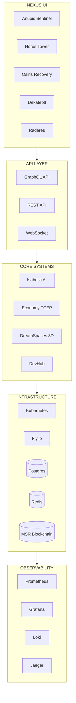

# TAMV MD-X4™ v7.0 - Arquitectura de Subsistemas Míticos

## Visión General

Este documento define la arquitectura completa para "industrializar" los subsistemas de control del Nexus TAMV, transformando conceptos míticos en sistemas operativos reales.

---

## 1. Subsistemas Míticos de Control

### 1.1 Anubis Sentinel v10

**Propósito:** Sistema de seguridad post-cuántica con 4 capas de guardianía

#### Arquitectura de 4 Capas

```
┌─────────────────────────────────────────────────────────────────┐
│                    ANUBIS SENTINEL v10                          │
├─────────────────────────────────────────────────────────────────┤
│  CAPA 4: EJECUCIÓN          │  Contramedidas activas, bloqueos  │
│  (Execution Layer)          │  automáticos, respuesta A/B       │
├─────────────────────────────────────────────────────────────────┤
│  CAPA 3: CORRELACIÓN        │  Análisis multi-dominio,          │
│  (Correlation Layer)        │  patrones de ataque, predicción   │
├─────────────────────────────────────────────────────────────────┤
│  CAPA 2: INGESTA            │  Eventos desde Isabella/MSR,      │
│  (Ingestion Layer)          │  logs, métricas, trazas           │
├─────────────────────────────────────────────────────────────────┤
│  CAPA 1: PERCEPCIÓN         │  Sensores, radares, endpoints,    │
│  (Perception Layer)         │  honeypots, decoys                │
└─────────────────────────────────────────────────────────────────┘
```

#### Componentes Clave

1. **Event Ingestion Service**: Recibe eventos de Isabella, MSR, Radares
2. **Correlation Engine**: Algoritmos ML para detectar patrones complejos
3. **Response Orchestrator**: Ejecuta contramedidas escalables (A/B)
4. **Guardian Dashboard**: UI táctil con 4 capas visibles

#### APIs

```typescript
interface AnubisSentinelAPI {
  // Ingesta de eventos
  ingestEvent(event: SecurityEvent): Promise<void>;
  
  // Correlación multi-dominio
  correlateEvents(events: SecurityEvent[]): Promise<ThreatPattern>;
  
  // Ejecución de contramedidas
  executeCountermeasure(threat: ThreatPattern, level: 'A' | 'B'): Promise<void>;
  
  // Escalamiento
  escalate(threat: ThreatPattern, reason: string): Promise<void>;
}
```

### 1.2 Horus Tower

**Propósito:** Observabilidad total con 5 dimensiones

#### Dimensiones de Observabilidad

```
┌────────────────────────────────────────────────────────────────┐
│                    HORUS TOWER v5                              │
├────────────────────────────────────────────────────────────────┤
│  DIMENSIÓN 5: RIESGO ÉTICO    │  Score ético, bias, fairness   │
├────────────────────────────────────────────────────────────────┤
│  DIMENSIÓN 4: PREDICCIÓN      │  ML forecasting, anomalías     │
├────────────────────────────────────────────────────────────────┤
│  DIMENSIÓN 3: ANOMALÍAS       │  Detección automática, alerts  │
├────────────────────────────────────────────────────────────────┤
│  DIMENSIÓN 2: TRAZAS          │  Distributed tracing, spans    │
├────────────────────────────────────────────────────────────────┤
│  DIMENSIÓN 1: MÉTRICAS        │  KPIs, SLIs, SLOs, dashboards  │
└────────────────────────────────────────────────────────────────┘
```

#### Componentes

1. **Metrics Collector**: Recopila métricas de cada dominio DM-X4
2. **Tracing Engine**: Trazas distribuidas entre cells K8s
3. **Anomaly Detector**: ML para detectar comportamientos anómalos
4. **Predictive Analytics**: Forecasting de capacidad y riesgos
5. **Ethical Risk Score**: Evaluación de fairness y bias

#### Dashboards por Dominio

- DM-X4 Social: Engagement, contenido, moderación
- DM-X4 XR: Latencia, render, presencia
- DM-X4 Economy: Transacciones, TCEP, wallet
- DM-X4 AI: Tokens, latencia, calidad respuestas
- DM-X4 Content: Sync, distribución, caché

### 1.3 Osiris Recovery

**Propósito:** Resiliencia con planes de recuperación A/B/C/D

#### Planes de Recuperación

```
PLAN A: RECUPERACIÓN RÁPIDA (RTO: 5 min)
├─ Snapshots de estado cada 30s
├─ Failover automático a réplica caliente
└─ Validación básica post-recuperación

PLAN B: RECUPERACIÓN ESTÁNDAR (RTO: 30 min)
├─ Snapshots cada 5 min
├─ Recuperación desde réplica tibia
├─ Runbook semi-automático
└─ Validación completa

PLAN C: RECUPERACIÓN EXTENDIDA (RTO: 4h)
├─ Snapshots cada 1h
├─ Recuperación desde cold storage
├─ Runbook manual con asistencia
└─ Validación exhaustiva

PLAN D: RECUPERACIÓN CATASTRÓFICA (RTO: 24h)
├─ Backups off-site
├─ Reconstrucción completa
├─ Validación de integridad MSR
└─ Re-sincronización federada
```

#### Componentes

1. **Snapshot Manager**: Gestiona snapshots de estado
2. **Runbook Engine**: Ejecuta playbooks de recuperación
3. **Validation Service**: Valida post-resurrección
4. **Recovery Dashboard**: Estado de recuperación en tiempo real

### 1.4 Dekateotl / Aztek Gods

**Propósito:** Gobernanza con 33 capas (11 + 22) como matrices operativas

#### Matriz de Gobernanza

```
11 CAPAS PRINCIPALES (Tlatoani)
├─ 1. Ontológica: Definición de lo que existe
├─ 2. Constitucional: Derechos y deberes
├─ 3. Política-Jurisdiccional: Ejercicio del poder
├─ 4. Económica: Circulación de valor
├─ 5. Cognitiva-Algorítmica: Límites de IA
├─ 6. Técnica-Infraestructural: Ejecución material
├─ 7. Histórica-Memorial: Registro inmutable
├─ 8. Social-Comunitaria: Interacción humana
├─ 9. Ecológica: Sostenibilidad
├─ 10. Defensiva: Seguridad soberana
└─ 11. Evolutiva: Adaptación y mejora

22 CAPAS AUXILIARES (Tlamatini)
├─ Implementaciones específicas de las 11 principales
└─ KPIs y métricas operativas por dominio
```

#### Componentes

1. **Governance Engine**: Evalúa estado de cada capa
2. **KPI Calculator**: Computa métricas en tiempo real
3. **Compliance Monitor**: Verifica adherencia a reglas
4. **Voting System**: Votaciones DAO por capa

### 1.5 Radares Quetzalcóatl / Ojo de Ra / MOS Gemelos

**Propósito:** Detección de señales internas/externas con redundancia

#### Tipos de Radar

```
QUETZALCÓATL: Radar Interno
├─ Señales del ecosistema TAMV
├─ Métricas, eventos, logs
└─ Detección de anomalías internas

OJO DE RA: Radar Externo
├─ Señales del mundo exterior
├─ Threat intelligence, CVEs, noticias
└─ Early warning de amenazas

MOS GEMELOS: Comparación
├─ Instancia A: Radar activo
├─ Instancia B: Radar pasivo
└─ Comparación para validación
```

#### Componentes

1. **Signal Ingestor**: Recibe señales de múltiples fuentes
2. **Twin Comparator**: Compara radares gemelos
3. **Signal Correlator**: Relaciona señales internas/externas
4. **Radar Dashboard**: Visualización dinámica

---

## 2. IA, Seguridad y Filtraciones

### 2.1 Isabella SDK

**Propósito:** Exponer capacidades de IA como SDK consistente

#### Arquitectura SDK

```
ISABELLA SDK v3.0
├─ Core
│  ├─ doublePipeline: Validación dual
│  ├─ hardStop: Parada de emergencia
│  └─ emotionalFilter: Filtros emocionales
├─ Hooks
│  ├─ useIsabellaChat: Chat hook
│  ├─ useIsabellaAnalysis: Análisis hook
│  └─ useIsabellaVoice: Voz hook
├─ Helpers
│  ├─ validateInput: Validación de entrada
│  ├─ sanitizeOutput: Sanitización de salida
│  └─ checkEthics: Verificación ética
└─ Middleware
   ├─ isabellaMiddleware: Express/Fastify
   └─ isabellaGuard: React/Vue guard
```

### 2.2 Sistema de Filtraciones

**Propósito:** Detectar, clasificar y gestionar fugas de información

#### Tipos de Filtraciones

```
NIVEL 1: IP (Propiedad Intelectual)
├─ Código fuente
├─ Algoritmos propietarios
└─ Modelos de IA

NIVEL 2: DATOS (Información sensible)
├─ Datos de usuarios
├─ Transacciones
└─ Métricas internas

NIVEL 3: SEGURIDAD (Vulnerabilidades)
├─ CVEs no reportados
├─ Configuraciones expuestas
└─ Credenciales
```

#### Componentes

1. **Leak Detector**: Escanea en tiempo real
2. **Classifier**: Clasifica por tipo y severidad
3. **Response Manager**: Orquesta respuesta
4. **Audit Logger**: Registra todo en MSR

### 2.3 Políticas MD-X5

**Propósito:** Automatismos para tráfico real según políticas MD-X4/X5

#### Políticas Automatizadas

```
THROTTLING
├─ Límites por usuario/tier
├─ Rate limiting adaptativo
└─ Circuit breakers

MODOS DEGRADADOS
├─ Modo ECO: Funcionalidad mínima
├─ Modo SAFE: Solo operaciones críticas
└─ Modo MAINT: Mantenimiento

BLOQUEOS POR RIESGO
├─ Auto-bloqueo por anomalía
├─ Bloqueo manual por admin
└─ Bloqueo por votación DAO
```

---

## 3. Datos, Economía y Espacios

### 3.1 Hooks de Datos Avanzados

**Propósito:** Estados avanzados con simulación COLD y stress testing

```typescript
interface UseRealDataAdvanced {
  // Estados normales
  data: T;
  loading: boolean;
  error: Error | null;
  
  // Estados avanzados
  simulation: 'LIVE' | 'COLD' | 'STRESS' | 'CHAOS';
  coldData: T | null; // Datos en modo COLD
  stressLevel: number; // 0-100
  retryCount: number;
  lastUpdated: Date;
  
  // Acciones
  simulate(scenario: SimulationScenario): void;
  refresh(): Promise<void>;
  invalidate(): void;
}
```

### 3.2 Motor 3D/4D

**Propósito:** Pipeline de creación/edición de DreamSpaces

#### Pipeline

```
CREACIÓN DE ESPACIO 3D/4D
1. Diseño
   ├─ Editor visual ( Three.js / Unity WebGL )
   ├─ Assets library
   └─ Templates predefinidos

2. Configuración
   ├─ Física cuántica
   ├─ Interactividad
   └─ Reglas de gobernanza

3. Publicación
   ├─ Validación
   ├─ Optimización
   └─ Deploy a CDN

4. Operación
   ├─ Monitoreo
   ├─ Analytics
   └─ Moderación
```

### 3.3 Economía TCEP Avanzada

**Propósito:** Instrumentos financieros complejos end-to-end

#### Componentes

```
NUBIWALLET PRO
├─ Staking
│  ├─ Stake TCEP por período
│  ├─ Rewards automáticos
│  └─ Unstaking con cooldown
├─ Liquidity Pools
│  ├─ Aportar liquidez
│  ├─ Earn fees
│  └─ Impermanent loss protection
├─ Rewards
│  ├─ Yield farming
│  ├─ Airdrops
│  └─ Bonos de participación
└─ DAO Governance
   ├─ Votación con TCEP
   ├─ Propuestas
   └─ Ejecución automática
```

---

## 4. DevHub, APIs y Ecosistema

### 4.1 DevHub TAMV/TAMVAI/BookPI

**Propósito:** Portal completo para desarrolladores externos

#### Componentes

```
DEVHUB NEXUS
├─ APIs
│  ├─ OpenAPI 3.0 specs
│  ├─ SDKs (JS, Python, Go)
│  └─ Postman collections
├─ Documentación
│  ├─ Quickstarts
│  ├─ Tutoriales
│  └─ Cookbooks
├─ Tools
│  ├─ API Key management
│  ├─ Usage dashboard
│  └─ Billing
└─ Community
   ├─ Forum
   ├─ Discord
   └─ Hackathons
```

### 4.2 BookPI / Playbook

**Propósito:** Servicios ejecutables para certificación y runbooks

```
BOOKPI CERTIFICATION
├─ Cursos
│  ├─ Contenido estructurado
│  ├─ Evaluaciones
│  └─ Proyectos
├─ Certificados
│  ├─ Blockchain-verified
│  ├─ NFT credentials
│  └─ Skills matrix
└─ Playbooks
   ├─ Runbooks ejecutables
   ├─ Validación automática
   └─ Reportes
```

---

## 5. Operación Industrial

### 5.1 Testing E2E

**Rutas Críticas a Testear:**

```
FLUJO 1: Autenticación
Signup → Verificación → Login → 2FA → Profile

FLUJO 2: Feed Social
Login → Feed → Create Post → Media → Interactions

FLUJO 3: NubiWallet
Login → Wallet → Deposit → Transfer → Withdraw

FLUJO 4: DevHub
Login → API Keys → Call API → Monitor Usage

FLUJO 5: Isabella
Login → Chat → Voice → Analysis → Report

FLUJO 6: Horus
Login → Dashboards → Metrics → Alerts → Response

FLUJO 7: Osiris
Trigger Failure → Recovery Plan → Validation

FLUJO 8: Radares
Signal Ingestion → Correlation → Alert → Response
```

### 5.2 Observabilidad Técnica

```
STACK DE OBSERVABILIDAD
├─ Logs: Loki / ELK
├─ Métricas: Prometheus + Grafana
├─ Trazas: Jaeger / Zipkin
├─ APM: New Relic / DataDog
└─ Alerting: PagerDuty + Opsgenie
```

### 5.3 Despliegues Multi-Región

```
TOPOLOGÍA FLY.IO
├─ Regiones
│  ├─ Americas: iad, ord, dfw, lax, gru, scl, mex
│  ├─ Europe: lhr, fra, ams, mad, cdg
│  ├─ Asia: sin, hkg, nrt, bom
│  └─ Oceania: syd
├─ Entornos
│  ├─ Dev: 1 región, 1 instancia
│  ├─ Stage: 3 regiones, 2 instancias
│  └─ Prod: 7 regiones, 3+ instancias
└─ Políticas MD-X4
   ├─ Blue-Green deployment
   ├─ Canary releases
   ├─ Auto-rollback
   └─ Health checks
```

---

## Diagrama de Arquitectura General



---

## Próximos Pasos de Implementación

1. **Fase 1**: Implementar subsistemas míticos (Anubis, Horus, Osiris)
2. **Fase 2**: Completar SDK de Isabella y sistema de filtraciones
3. **Fase 3**: Motor 3D/4D y economía TCEP avanzada
4. **Fase 4**: DevHub completo con APIs formales
5. **Fase 5**: Testing E2E y observabilidad

---

**Documento v1.0 - TAMV MD-X4™ Architecture Team**
