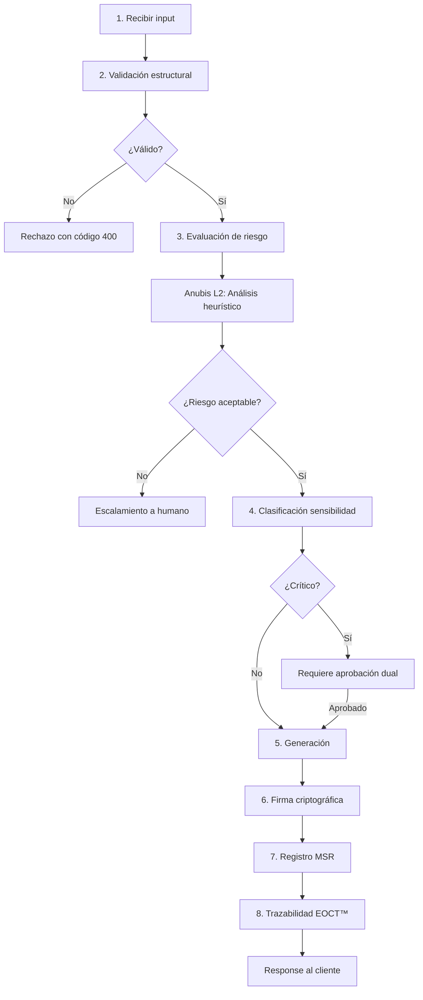

# 🧿 TAMV Unified API™ & TAMVAI API™

## Master de Ingeniería Técnica Institucional

**Versión:** 3.0.0-Sovereign  
**Clasificación:** Infraestructura Estratégica  
**Estado:** Arquitectura Integral Formalizada  
**Canon Prevalente:** [`docs/MASTER_CANON_OPENCLAW_TAMV.md`](docs/MASTER_CANON_OPENCLAW_TAMV.md)  
**Arquitectura Base:** [`docs/02_arquitectura_tamv_mdx4.md`](docs/02_arquitectura_tamv_mdx4.md)

---

## 📋 Índice de Contenidos

1. [Preámbulo Constitucional Técnico](#1%EF%B8%8F%E2%83%A3-pre%C3%A1mbulo-constitucional-t%C3%A9cnico)
2. [Marco Filosófico, Ético y Jurídico](#2%EF%B8%8F%E2%83%A3-marco-filos%C3%B3fico-%C3%A9tico-y-jur%C3%ADdico)
3. [Arquitectura General](#3%EF%B8%8F%E2%83%A3-arquitectura-general)
4. [Manual Operativo para IA](#4%EF%B8%8F%E2%83%A3-manual-operativo-para-ia)
5. [Blueprint Técnico de Implementación](#5%EF%B8%8F%E2%83%A3-blueprint-t%C3%A9cnico-de-implementaci%C3%B3n)
6. [Seguridad y Guardianías](#6%EF%B8%8F%E2%83%A3-seguridad-y-guardian%C3%ADas)
7. [Observabilidad y Auditoría](#7%EF%B8%8F%E2%83%A3-observabilidad-y-auditor%C3%ADa)
8. [Especificación API Unificada](#8%EF%B8%8F%E2%83%A3-especificaci%C3%B3n-api-unificada)
9. [OpenAPI/Swagger Contract](#9%EF%B8%8F%E2%83%A3-openapiswagger-contract)
10. [Roadmap y Versionado](#%F0%9F%94%B7-roadmap-y-versionado)

---

# 1️⃣ PREÁMBULO CONSTITUCIONAL TÉCNICO

La TAMV Unified API™ constituye la capa soberana de interoperabilidad tecnológica del ecosistema TAMV DM-X4™. Su diseño responde a principios de:

* **Soberanía digital estructural** — Control total sobre infraestructura y datos
* **Trazabilidad verificable** — Cada operación registrada con firma criptográfica
* **Seguridad criptográfica avanzada** — Preparación post-cuántica híbrida
* **Interoperabilidad modular** — Dominios DM-X4 como células autónomas interoperables
* **Gobernanza técnica distribuida** — Consenso federado entre nodos
* **Auditoría inmutable** — Registro permanente en MSR (Memory · State · Rules)

### 1.1 Relación con Arquitectura MD-X4

La TAMV Unified API™ opera en la **Capa 4 (Fusion Core)** y **Capa 5 (Nexus)** de la arquitectura MD-X4, actuando como interfaz unificada entre:

- Clientes externos (aplicaciones, servicios federados)
- Edge Functions de Supabase (funciones serverless)
- Sistemas míticos de control (Anubis, Horus, Osiris)
- MSR — Motor de estado y reglas

```
┌─────────────────────────────────────────────────────────────────────┐
│                    TAMV Unified API™ v3.0.0                         │
│  ┌──────────────┐  ┌──────────────┐  ┌──────────────────────────┐   │
│  │  Pipeline A  │  │  Pipeline B  │  │         CCP              │   │
│  │  (Crítico)   │◄─┤  (IA/Adapt)  │◄─┤   Control & Coordination │   │
│  └──────┬───────┘  └──────┬───────┘  └──────────────────────────┘   │
│         │                 │                                         │
│         ▼                 ▼                                         │
│  ┌────────────────────────────────────────────────────────────┐    │
│  │              QuantumSecurityLayer™ (QSL)                    │    │
│  │         Kyber KEM · Dilithium · Entropía Validada          │    │
│  └────────────────────────────────────────────────────────────┘    │
│                              │                                      │
│                              ▼                                      │
│  ┌────────────────────────────────────────────────────────────┐    │
│  │              Anubis Sentinel™ v10 — 4 Capas                │    │
│  │   Percepción → Ingesta → Correlación → Ejecución           │    │
│  └────────────────────────────────────────────────────────────┘    │
│                              │                                      │
└──────────────────────────────┼──────────────────────────────────────┘
                               │
         ┌─────────────────────┼─────────────────────┐
         ▼                     ▼                     ▼
┌─────────────────┐  ┌─────────────────┐  ┌─────────────────┐
│  DM-X4-01 CORE  │  │  DM-X4-02 IA    │  │  DM-X4-03 SEC   │
│  Plataforma     │  │  Isabella/SOF   │  │  Guardianías    │
├─────────────────┤  ├─────────────────┤  ├─────────────────┤
│  DM-X4-04 EDU   │  │  DM-X4-05 ECO   │  │  DM-X4-06 XR    │
│  UTAMV/BookPI   │  │  MSR/Tokens     │  │  Render/Inmerso │
└─────────────────┘  └─────────────────┘  └─────────────────┘
```

---

# 2️⃣ MARCO FILOSÓFICO, ÉTICO Y JURÍDICO

## 2.1 Principios Rectores

| Principio | Descripción | Implementación Técnica |
|-----------|-------------|------------------------|
| **Primacía de la Seguridad** | Seguridad por diseño, no como añadido | QSL en todas las comunicaciones |
| **Trazabilidad Total** | Cada operación registrada y verificable | EOCT™ + MSR con hash SHA3-256 |
| **Explicabilidad Algorítmica** | Decisiones de IA auditable | Logs de reasoning en Anubis L2 |
| **Interoperabilidad Controlada** | Federación con validación | Gateway Dekateotl™ 11-capas |
| **Auditoría Permanente** | Registro continuo sin gaps | Horus Tower 5 dimensiones |
| **Modularidad Evolutiva** | Componentes intercambiables | Cells DM-X4 con interfaces estándar |

## 2.2 Marco Ético para IA (TAMVAI API™)

La TAMVAI API™ se rige por los siguientes mandatos ético-técnicos:

- **Separación clara entre generación y ejecución**
  - Pipeline B (IA) genera contenido/propuestas
  - Pipeline A (Crítico) valida y ejecuta acciones
  - Nunca se permite ejecución directa desde generación

- **Registro obligatorio de decisiones críticas**
  - Toda decisión con impacto > umbral ético se registra en MSR
  - Campos requeridos: `decision_hash`, `context_vector`, `confidence_score`

- **Validación humana en operaciones sensibles**
  - Transacciones > 1000 TAU requieren 2FA
  - Cambios de configuración crítica requieren aprobación dual

- **Supervisión Anubis Sentinel™**
  - Análisis heurístico en tiempo real (L2)
  - Bloqueo autónomo ante patrones de riesgo (L3)

- **Trazabilidad emocional (EOCT™)**
  - Registro del estado emocional del usuario durante interacciones
  - Prevención de manipulación emocional por sistemas IA

## 2.3 Cumplimiento Normativo Internacional

| Estándar | Aplicación en TAMV Unified API™ |
|----------|--------------------------------|
| **ISO/IEC 27001** | Gestión de seguridad de la información — Implementado en QSL |
| **ISO/IEC 42001** | Sistemas de gestión de IA — Trazabilidad EOCT™ |
| **NIST CSF** | Marco de ciberseguridad — Anubis Sentinel v10 |
| **GDPR** | Protección de datos — Derecho al olvido en MSR |
| **NIST PQC** | Criptografía post-cuántica — Kyber + Dilithium |

---

# 3️⃣ ARQUITECTURA GENERAL

## 3.1 Visión Macro — Flujo de Datos

```
┌─────────────────────────────────────────────────────────────────────────────┐
│                         CLIENTES EXTERNOS                                    │
│  (Web App · Mobile · Federados · IoT · IA Agents)                           │
└───────────────────────────────────┬─────────────────────────────────────────┘
                                    │ HTTPS/WSS
                                    ▼
┌─────────────────────────────────────────────────────────────────────────────┐
│                     DEKATEOTL Gateway™ — Capa Perimetral                     │
│  • Rate Limiting · WAF · DDoS Protection · Geo-fencing                      │
│  • 11-capas de validación inicial (ver docs/08_seguridad_sentinel_y_radares)│
└───────────────────────────────────┬─────────────────────────────────────────┘
                                    │
                                    ▼
┌─────────────────────────────────────────────────────────────────────────────┐
│                      IGU™ — Intelligent Gateway Unit                         │
│  • Routing inteligente por dominio/action                                   │
│  • Load balancing entre cells                                               │
│  • Circuit breaker para fallos en cascada                                   │
└───────────────┬───────────────────┬───────────────────┬─────────────────────┘
                │                   │                   │
                ▼                   ▼                   ▼
┌───────────────────────┐ ┌───────────────────────┐ ┌───────────────────────┐
│     PIPELINE A        │ │     PIPELINE B        │ │         CCP           │
│   (Operaciones        │ │   (Inteligencia       │ │  Control & Coordination│
│     Críticas)         │ │    Adaptativa)        │ │      Plane            │
├───────────────────────┤ ├───────────────────────┤ ├───────────────────────┤
│ • Autenticación       │ │ • Generación contenido│ │ • Orquestación        │
│ • Seguridad           │ │ • Análisis emocional  │ │ • Gestión políticas   │
│ • Firmas digitales    │ │ • Modelado predictivo │ │ • Gobernanza          │
│ • Transacciones       │ │ • Personalización     │ │ • Versionado API      │
│ • Pagos               │ │ • TAMV Voice™ (TTS)   │ │ • Control despliegues │
│ • Control acceso      │ │ • Análisis sentimiento│ │ • A/B testing         │
└───────────┬───────────┘ └───────────┬───────────┘ └───────────┬───────────┘
            │                       │                       │
            └───────────────────────┼───────────────────────┘
                                    │
                                    ▼
┌─────────────────────────────────────────────────────────────────────────────┐
│                   QuantumSecurityLayer™ (QSL)                               │
│  ┌─────────────────┐  ┌─────────────────┐  ┌─────────────────┐             │
│  │  Kyber KEM      │  │  Dilithium      │  │  Entropía       │             │
│  │  (Key Encaps)   │  │  (Signatures)   │  │  Validada       │             │
│  └─────────────────┘  └─────────────────┘  └─────────────────┘             │
│  ┌─────────────────┐  ┌─────────────────┐  ┌─────────────────┐             │
│  │  RNG Certificado│  │  Rotación Auto  │  │  HSM Opcional   │             │
│  │  (NIST SP 800)  │  │  de Claves      │  │  Integration    │             │
│  └─────────────────┘  └─────────────────┘  └─────────────────┘             │
└───────────────────────────────────┬─────────────────────────────────────────┘
                                    │
                                    ▼
┌─────────────────────────────────────────────────────────────────────────────┐
│                      ANUBIS SENTINEL™ v10                                   │
│  ┌─────────────────────────────────────────────────────────────────────┐   │
│  │ CAPA 4: EJECUCIÓN    │ Contramedidas activas, bloqueos automáticos   │   │
│  ├─────────────────────────────────────────────────────────────────────┤   │
│  │ CAPA 3: CORRELACIÓN  │ ML patterns, análisis multi-dominio, predicc. │   │
│  ├─────────────────────────────────────────────────────────────────────┤   │
│  │ CAPA 2: INGESTA      │ Eventos Isabella/MSR/logs/métricas/trazas     │   │
│  ├─────────────────────────────────────────────────────────────────────┤   │
│  │ CAPA 1: PERCEPCIÓN   │ Sensores, radares, endpoints, honeypots       │   │
│  └─────────────────────────────────────────────────────────────────────┘   │
└───────────────────────────────────┬─────────────────────────────────────────┘
                                    │
            ┌───────────────────────┼───────────────────────┐
            ▼                       ▼                       ▼
┌───────────────────┐   ┌───────────────────┐   ┌───────────────────┐
│      EOCT™        │   │       MSR         │   │  HORUS TOWER™     │
│  Emotional        │   │  Memory · State   │   │  5 Dimensiones    │
│  Operations       │   │  · Rules          │   │  Observabilidad   │
│  Chain Tracker    │   │                   │   │                   │
│                   │   │ • Estado global   │   │ • Métricas (SLIs) │
│ • Hash emocional  │   │ • Reglas negocio  │   │ • Trazas dist.    │
│ • Context vector  │   │ • Rutas dinámicas │   │ • Anomalías ML    │
│ • Audit trail     │   │ • Event sourcing  │   │ • Predicción      │
│ • Consent log     │   │ • Snapshots       │   │ • Riesgo ético    │
└───────────────────┘   └───────────────────┘   └───────────────────┘
```

## 3.2 Pipeline A — Operaciones Críticas (Synchronous)

**SLA Objetivo:** 99.99% uptime, <100ms p95 latency

| Servicio | Puerto | Función | Protocolo | Respaldo |
|----------|--------|---------|-----------|----------|
| `auth-service` | 8001 | Autenticación JWT + OAuth2 + PQC | REST/HTTPS | Fallback a JWT clásico |
| `security-service` | 8002 | Criptografía híbrida (RSA+Dilithium) | gRPC/REST | Cache de claves 24h |
| `identity-service` | 8003 | Gestión de identidades federadas | REST | Replicación geo |
| `transaction-service` | 8004 | Procesamiento transaccional ACID | REST/gRPC | Saga pattern |
| `payment-service` | 8005 | Integración Stripe + TAU/TCEP | REST | Queue de retry |
| `access-control` | 8006 | RBAC + ABAC + Políticas dinámicas | REST | Cache Redis |

### Flujo Pipeline A

```
1. Request → Dekateotl Gateway (validación inicial)
2. → IGU (routing)
3. → Pipeline A (servicio específico)
4. → QSL (firma/validación si aplica)
5. → Anubis L1-L2 (validación de seguridad)
6. → Ejecución
7. → Anubis L3 (post-ejecución audit)
8. → Registro MSR + EOCT™
9. → Response al cliente
```

## 3.3 Pipeline B — Inteligencia Adaptativa (Asynchronous/Event-Driven)

**SLA Objetivo:** 99.9% uptime, <2s p95 latency (generación)

| Servicio | Puerto | Función | Modelo/Stack |
|----------|--------|---------|--------------|
| `ai-generation-service` | 8101 | Generación texto/imagen/código | LLM multi-provider |
| `ai-analysis-service` | 8102 | Análisis emocional, sentimiento | Propio + OpenAI |
| `ai-prediction-service` | 8103 | Modelado predictivo, forecasting | Prophet + TensorFlow |
| `personalization-engine` | 8104 | Recomendaciones, perfiles adaptativos | Embeddings + Redis |
| `voice-service` | 8105 | TTS (TAMV Voice™), STT | ElevenLabs + Whisper |
| `embedding-service` | 8106 | Vectorización, RAG, búsqueda semántica | pgvector + OpenAI |

### Flujo Pipeline B

```
1. Request → Dekateotl Gateway
2. → IGU (clasifica como IA)
3. → Pipeline B
4. → Validación de riesgo (Anubis L2 heurístico)
5. → Generación/Análisis
6. → Post-procesamiento (filtros éticos)
7. → Firma criptográfica de salida
8. → Registro MSR + EOCT™ + trace_id
9. → Response (o webhook si async)
```

## 3.4 CCP — Control & Coordination Plane

El CCP es el cerebro orquestador que gestiona la infraestructura y gobernanza:

| Componente | Función | Tecnología |
|------------|---------|------------|
| `orchestrator` | Despliegue, scaling, health checks | Kubernetes + Custom Operator |
| `policy-engine` | Evaluación de políticas en tiempo real | OPA (Open Policy Agent) |
| `governance-service` | Votaciones federadas, consenso | Raft / BFT (futuro) |
| `version-manager` | Control de versiones API, deprecación | Semantic versioning + flags |
| `deployment-controller` | Canary, blue-green, rollback | ArgoCD + Flagger |
| `circuit-breaker` | Aislamiento de fallos, bulkhead | Resilience4j / Istio |

---

# 4️⃣ MANUAL OPERATIVO PARA IA

## 4.1 Roles de IA en el Ecosistema

| Rol | Entidad | Función | Pipeline |
|-----|---------|---------|----------|
| **Isabella AI™** | Agente conversacional | Adaptación emocional, asistencia | Pipeline B |
| **Anubis Sentinel™** | Sistema de seguridad | Supervisión, detección, respuesta | CCP + Pipeline A |
| **EOCT™** | Subsistema de registro | Trazabilidad emocional | Cross-cutting |
| **QuantumSecurityLayer™** | Capa criptográfica | Firma y cifrado | Pipeline A |
| **THE SOF** | Shadow Engine | Orquestación multiagente | Pipeline B |

## 4.2 Protocolo de Generación Responsable (Isabella)



### Detalle de Pasos

**Paso 2 — Validación Estructural:**
- Schema validation con Zod
- Sanitización de input (XSS, injection)
- Rate limiting por usuario

**Paso 3 — Evaluación de Riesgo:**
- Toxicity detection (Perspective API)
- PII detection
- Prompt injection detection
- Jailbreak attempt detection

**Paso 5 — Generación:**
- Timeout: 15s (con fallback a texto)
- Max tokens: 4000
- Temperature: context-dependent

**Paso 6 — Firma Criptográfica:**
- Cada respuesta firmada con clave efímera
- Hash SHA3-256 del contenido
- Timestamp + trace_id

**Paso 8 — EOCT™:**
- Registro del estado emocional detectado
- Contexto de la conversación (hash)
- Nivel de confianza de la detección

## 4.3 Control de Deriva Algorítmica

Para prevenir la degradación del comportamiento de los modelos:

| Mecanismo | Frecuencia | Responsable |
|-----------|------------|-------------|
| **Reentrenamiento supervisado** | Trimestral | Equipo ML TAMV |
| **Auditorías periódicas** | Mensual | Anubis Sentinel L3 |
| **Validación cruzada federada** | Semanal | Nodos federados |
| **Métricas de coherencia** | En tiempo real | Horus Tower |

### Métricas de Coherencia Contextual

```typescript
interface CoherenceMetrics {
  context_window_usage: number;      // 0-1, uso de ventana de contexto
  topic_drift_score: number;         // 0-1, desviación de tema
  emotional_consistency: number;     // 0-1, consistencia emocional
  hallucination_risk: number;        // 0-1, riesgo de alucinación
  factuality_score: number;          // 0-1, verificación factual
  
  // Umbrales de alerta
  ALERT_THRESHOLD: 0.3;
  BLOCK_THRESHOLD: 0.15;
}
```

---

# 5️⃣ BLUEPRINT TÉCNICO DE IMPLEMENTACIÓN

## 5.1 Stack Recomendado

| Capa | Tecnología | Justificación |
|------|------------|---------------|
| **Backend API** | FastAPI (Python) / Node.js (TS) | Rendimiento + tipado |
| **Edge Functions** | Supabase Functions (Deno) | Proximidad a datos |
| **Base de datos** | PostgreSQL + Redis | ACID + Cache |
| **Vector DB** | pgvector | RAG integrado |
| **Seguridad** | OAuth2 + JWT + PQC (OQS) | Estándar + futuro |
| **Observabilidad** | Prometheus + Grafana + Tempo | Métricas/trazas/logs |
| **Message Queue** | Redis Streams / RabbitMQ | Event-driven |
| **Blockchain (opt)** | Polygon/Hyperledger | Auditoría inmutable |

## 5.2 Microservicios Base — Especificación Completa

### Pipeline A — Operaciones Críticas

```yaml
# auth-service (8001)
service:
  name: auth-service
  port: 8001
  replicas: 3
  
endpoints:
  - POST /auth/login           # JWT + optional PQC
  - POST /auth/logout          # Invalidación de token
  - POST /auth/refresh         # Refresh token rotation
  - POST /auth/mfa/enable      # 2FA setup (TOTP)
  - POST /auth/mfa/verify      # 2FA verification
  - GET  /auth/validate        # Token introspection
  
dependencies:
  - postgres
  - redis
  
security:
  rate_limit: 10/min
  require_mfa: true  # for admin tier

# security-service (8002)
service:
  name: security-service
  port: 8002
  replicas: 2
  
endpoints:
  - POST /crypto/hybrid-key      # Genera par de claves híbrido
  - POST /crypto/sign            # Firma con Dilithium
  - POST /crypto/verify          # Verificación de firma
  - POST /crypto/encrypt         # Encriptación Kyber
  - POST /crypto/decrypt         # Desencriptación
  - GET  /crypto/entropy         # Estado del RNG
  - GET  /security/audit         # Logs de seguridad
  
dependencies:
  - hsm (optional)
  - vault

# transaction-service (8004)
service:
  name: transaction-service
  port: 8004
  replicas: 3
  
endpoints:
  - POST /tx/create              # Crear transacción
  - POST /tx/confirm             # Confirmar con firma
  - GET  /tx/{id}                # Consultar estado
  - GET  /tx/history             # Historial por usuario
  
patterns:
  - Saga pattern para consistencia distribuida
  - Outbox pattern para eventos
  
dependencies:
  - postgres
  - message-queue

# payment-service (8005)
service:
  name: payment-service
  port: 8005
  replicas: 2
  
endpoints:
  - POST /payments/create        # Crear pago Stripe/TAU
  - GET  /payments/{id}/status   # Estado del pago
  - POST /payments/webhook       # Webhook Stripe
  - POST /payments/refund        # Reembolso
  
integrations:
  - Stripe
  - Internal TAU ledger
  
dependencies:
  - stripe-api
  - transaction-service
```

### Pipeline B — Inteligencia Adaptativa

```yaml
# ai-generation-service (8101)
service:
  name: ai-generation-service
  port: 8101
  replicas: 5
  
endpoints:
  - POST /ai/generate/text       # Generación de texto
  - POST /ai/generate/code       # Generación de código
  - POST /ai/generate/image      # Generación de imagen
  - POST /ai/analyze/sentiment   # Análisis de sentimiento
  - POST /ai/analyze/emotion     # Análisis emocional EOCT™
  - POST /ai/analyze/toxicity    # Detección de toxicidad
  
providers:
  - OpenAI GPT-4
  - Anthropic Claude
  - Local LLM (fallback)
  
cache:
  strategy: semantic
  ttl: 3600
  
dependencies:
  - redis
  - embedding-service

# voice-service (8105)
service:
  name: voice-service
  port: 8105
  replicas: 2
  
endpoints:
  - POST /voice/tts              # Text-to-Speech
  - POST /voice/stt              # Speech-to-Text
  - GET  /voice/voices           # Listar voces disponibles
  
integrations:
  - ElevenLabs (primary)
  - Azure TTS (fallback)
  
cache:
  strategy: exact-match (SHA256)
  ttl: 604800  # 7 días
  
dependencies:
  - redis
  - blob-storage
```

### CCP — Control & Coordination

```yaml
# orchestrator (8200)
service:
  name: orchestrator
  port: 8200
  replicas: 3
  
endpoints:
  - GET  /health                 # Health check global
  - GET  /metrics                # Métricas Prometheus
  - POST /deploy                 # Trigger deployment
  - POST /rollback               # Rollback de servicio
  - GET  /services               # Estado de servicios
  
integrations:
  - Kubernetes API
  - ArgoCD
  
# policy-engine (8201)
service:
  name: policy-engine
  port: 8201
  replicas: 2
  
endpoints:
  - POST /policy/evaluate        # Evaluar request vs políticas
  - GET  /policies               # Listar políticas activas
  - POST /policies               # Crear nueva política
  - PUT  /policies/{id}          # Actualizar política
  
engine: OPA (Open Policy Agent)

# governance-service (8202)
service:
  name: governance-service
  port: 8202
  replicas: 2
  
endpoints:
  - POST /governance/proposal    # Crear propuesta
  - POST /governance/vote        # Emitir voto
  - GET  /governance/proposals   # Listar propuestas
  - GET  /governance/results     # Resultados de votación
  
consensus: Raft (fase I) → BFT (fase III)
```

## 5.3 Diagrama de Despliegue (K8s)

```yaml
# Namespace: tamv-api
apiVersion: v1
kind: Namespace
metadata:
  name: tamv-api
  labels:
    istio-injection: enabled
    tamv-tier: sovereign

---
# Ejemplo: auth-service deployment
apiVersion: apps/v1
kind: Deployment
metadata:
  name: auth-service
  namespace: tamv-api
spec:
  replicas: 3
  selector:
    matchLabels:
      app: auth-service
  template:
    metadata:
      labels:
        app: auth-service
        tier: pipeline-a
    spec:
      containers:
      - name: auth
        image: tamv/auth-service:3.0.0-sovereign
        ports:
        - containerPort: 8001
        env:
        - name: DATABASE_URL
          valueFrom:
            secretKeyRef:
              name: tamv-db-credentials
              key: url
        - name: JWT_SECRET
          valueFrom:
            secretKeyRef:
              name: tamv-jwt-secret
              key: secret
        - name: PQC_ENABLED
          value: "true"
        resources:
          requests:
            memory: "256Mi"
            cpu: "250m"
          limits:
            memory: "512Mi"
            cpu: "500m"
        livenessProbe:
          httpGet:
            path: /health
            port: 8001
          initialDelaySeconds: 30
          periodSeconds: 10
        readinessProbe:
          httpGet:
            path: /ready
            port: 8001
          initialDelaySeconds: 5
          periodSeconds: 5
      affinity:
        podAntiAffinity:
          preferredDuringSchedulingIgnoredDuringExecution:
          - weight: 100
            podAffinityTerm:
              labelSelector:
                matchExpressions:
                - key: app
                  operator: In
                  values:
                  - auth-service
              topologyKey: kubernetes.io/hostname
```

---

# 6️⃣ SEGURIDAD Y GUARDIANÍAS

## 6.1 Capas de Seguridad (Defense in Depth)

```
┌─────────────────────────────────────────────────────────────────────┐
│ CAPA 6: APLICACIÓN                                                  │
│ • Input validation · Output encoding · Rate limiting               │
├─────────────────────────────────────────────────────────────────────┤
│ CAPA 5: AUTENTICACIÓN Y AUTORIZACIÓN                                │
│ • OAuth2 · JWT · RBAC · ABAC · PQC signatures                      │
├─────────────────────────────────────────────────────────────────────┤
│ CAPA 4: API GATEWAY                                                 │
│ • Dekateotl™ 11-capas · WAF · DDoS protection · Geo-fencing        │
├─────────────────────────────────────────────────────────────────────┤
│ CAPA 3: RED                                                         │
│ • mTLS entre servicios · Network policies · Service mesh (Istio)   │
├─────────────────────────────────────────────────────────────────────┤
│ CAPA 2: CONTENEDOR                                                  │
│ • Non-root containers · Read-only filesystems · Security contexts  │
├─────────────────────────────────────────────────────────────────────┤
│ CAPA 1: INFRAESTRUCTURA                                             │
│ • HSM (opcional) · Secure boot · Encrypted volumes · Audit logging │
└─────────────────────────────────────────────────────────────────────┘
```

## 6.2 QuantumSecurityLayer™ (QSL)

### Funciones Principales

| Función | Algoritmo | Estado | Uso |
|---------|-----------|--------|-----|
| Key Encapsulation | Kyber-1024 | Estable | Intercambio de claves sesión |
| Digital Signature | Dilithium-3 | Estable | Firma de transacciones/logs |
| Hash | SHA3-256 | Estable | Integridad de datos |
| RNG | NIST SP 800-90A | Certificado | Generación de entropía |

### Implementación OQS (Open Quantum Safe)

```python
# Ejemplo: Firma híbrida con OQS
from oqs import Signature

class QuantumSecurityLayer:
    def __init__(self):
        self.sig_alg = "Dilithium3"
        self.kem_alg = "Kyber1024"
    
    def generate_keypair(self) -> tuple[bytes, bytes]:
        """Genera par de claves post-cuánticas"""
        sig = Signature(self.sig_alg)
        public_key = sig.generate_keypair()
        secret_key = sig.export_secret_key()
        return public_key, secret_key
    
    def sign(self, message: bytes, secret_key: bytes) -> bytes:
        """Firma un mensaje con Dilithium3"""
        sig = Signature(self.sig_alg, secret_key)
        return sig.sign(message)
    
    def verify(self, message: bytes, signature: bytes, public_key: bytes) -> bool:
        """Verifica una firma"""
        sig = Signature(self.sig_alg)
        return sig.verify(message, signature, public_key)
    
    def hybrid_encrypt(self, plaintext: bytes, public_key: bytes) -> bytes:
        """Encriptación híbrida: RSA + Kyber (transición)"""
        # Implementación fallback para compatibilidad
        pass
```

### Rotación Automática de Claves

```yaml
# Configuración de rotación
key_rotation:
  enabled: true
  schedule: "0 2 * * 0"  # Domingos 2 AM
  algorithms:
    - Kyber1024
    - Dilithium3
  grace_period: 24h  # Período de gracia para claves antiguas
  emergency_rotation:
    trigger: compromise_detected
    auto_revoke: true
```

## 6.3 Guardianías Anubis Sentinel™

Integración con [`docs/modules/guardianias/`](docs/modules/guardianias/) y [`docs/08_seguridad_sentinel_y_radares.md`](docs/08_seguridad_sentinel_y_radares.md)

### Niveles de Guardianía

| Nivel | Nombre | Función | Acción Autónoma |
|-------|--------|---------|-----------------|
| **L1** | Validación Básica | Verificación de firma, rate limits, schema | Alerta |
| **L2** | Análisis Heurístico | ML patterns, detección de anomalías, correlación | Alerta + Log |
| **L3** | Bloqueo Autónomo | Bloqueo de IPs, suspensiones temporales, CAPTCHA | Bloqueo 15 min |
| **L4** | Aislamiento del Nodo | Aislamiento de servicio, redirección a standby, forense | Aislamiento completo |

### API Anubis Sentinel™

```typescript
// src/systems/AnubisSecuritySystem.ts — Actualizado v3.0.0

interface AnubisSentinelAPI {
  // L1: Percepción e Ingesta
  ingestEvent(event: SecurityEvent): Promise<IngestionResult>;
  validateRequest(req: Request): Promise<ValidationResult>;
  
  // L2: Correlación
  correlateEvents(events: SecurityEvent[]): Promise<ThreatPattern>;
  detectAnomaly(metrics: SystemMetrics): Promise<AnomalyReport>;
  
  // L3: Ejecución de Contramedidas
  executeCountermeasure(
    threat: ThreatPattern, 
    level: 'L1' | 'L2' | 'L3' | 'L4'
  ): Promise<CountermeasureResult>;
  
  // L4: Escalamiento y Aislamiento
  escalate(threat: ThreatPattern, reason: string): Promise<void>;
  isolateNode(nodeId: string, reason: string): Promise<IsolationResult>;
  
  // Quantum-specific
  validateQuantumSignature(
    payload: string, 
    signature: string, 
    publicKey: string
  ): Promise<boolean>;
  
  // EOCT™ Integration
  logEmotionalContext(
    userId: string, 
    emotionVector: EmotionVector, 
    trigger: string
  ): Promise<void>;
}
```

---

# 7️⃣ OBSERVABILIDAD Y AUDITORÍA

## 7.1 Horus Tower™ — 5 Dimensiones

Integración con [`docs/ARCHITECTURE_MITHIC_SUBSYSTEMS_V7.md`](docs/ARCHITECTURE_MITHIC_SUBSYSTEMS_V7.md)

```
┌─────────────────────────────────────────────────────────────────────────┐
│                    HORUS TOWER™ v5 — Observabilidad Total               │
├─────────────────────────────────────────────────────────────────────────┤
│ DIMENSIÓN 5: RIESGO ÉTICO                                               │
│ • Score ético por operación · Bias detection · Fairness metrics        │
├─────────────────────────────────────────────────────────────────────────┤
│ DIMENSIÓN 4: PREDICCIÓN                                                 │
│ • ML forecasting · Capacity planning · Anomaly prediction              │
├─────────────────────────────────────────────────────────────────────────┤
│ DIMENSIÓN 3: ANOMALÍAS                                                  │
│ • Statistical anomalies · ML-based detection · Alerting               │
├─────────────────────────────────────────────────────────────────────────┤
│ DIMENSIÓN 2: TRAZAS                                                     │
│ • Distributed tracing · OpenTelemetry · Span correlation               │
├─────────────────────────────────────────────────────────────────────────┤
│ DIMENSIÓN 1: MÉTRICAS                                                   │
│ • KPIs · SLIs · SLOs · Dashboards por dominio DM-X4                    │
└─────────────────────────────────────────────────────────────────────────┘
```

### Métricas Clave (SLIs)

| Métrica | Objetivo | Alerta | Crítico |
|---------|----------|--------|---------|
| **Latencia p95** | < 100ms | > 200ms | > 500ms |
| **Tasa de error** | < 0.1% | > 0.5% | > 1% |
| **Índice de entropía** | > 7.5 bits | < 7.0 bits | < 6.0 bits |
| **Coherencia emocional** | > 0.8 | < 0.6 | < 0.4 |
| **Validaciones fallidas** | < 0.01% | > 0.1% | > 1% |
| **Disponibilidad** | 99.99% | < 99.9% | < 99% |

## 7.2 Log Estructurado (EOCT™ + MSR)

### Formato Estándar

```json
{
  "trace_id": "550e8400-e29b-41d4-a716-446655440000",
  "span_id": "7b3d5e91-8c2f-4a1e",
  "parent_span_id": null,
  "user_id": "uuid-de-usuario",
  "session_id": "uuid-de-sesion",
  "module": "ai-generation-service",
  "pipeline": "B",
  "action": "text_generation",
  "risk_level": "low",
  "quantum_signature": "base64-encoded-dilithium-sig",
  "eoct_hash": "sha3-256-hash-of-emotional-context",
  "timestamp": "2026-03-04T14:36:52.174Z",
  "duration_ms": 1250,
  "status": "success",
  "metadata": {
    "model": "gpt-4",
    "tokens_input": 150,
    "tokens_output": 320,
    "emotion_detected": "neutral",
    "confidence": 0.92
  },
  "compliance": {
    "gdpr": true,
    "iso27001": true,
    "audit_retention_years": 7
  }
}
```

### Retención de Logs

| Tipo | Retención | Almacenamiento |
|------|-----------|----------------|
| Logs operativos | 30 días | Hot (SSD) |
| Logs de auditoría | 7 años | Cold (S3 Glacier) |
| EOCT™ records | 3 años | Warm (S3 Standard-IA) |
| Quantum signatures | Permanentemente | Blockchain (opcional) |

## 7.3 Integración Blockchain (Opcional)

Para casos de uso que requieren inmutabilidad absoluta:

```solidity
// SPDX-License-Identifier: MIT
pragma solidity ^0.8.0;

contract TAMVAuditLedger {
    struct AuditRecord {
        bytes32 traceId;
        bytes32 eoctHash;
        bytes32 quantumSignature;
        uint256 timestamp;
        string module;
        bool exists;
    }
    
    mapping(bytes32 => AuditRecord) public records;
    bytes32[] public recordIndex;
    
    event AuditRecordStored(
        bytes32 indexed traceId,
        bytes32 indexed eoctHash,
        uint256 timestamp
    );
    
    function storeRecord(
        bytes32 _traceId,
        bytes32 _eoctHash,
        bytes32 _quantumSignature,
        string calldata _module
    ) external {
        require(!records[_traceId].exists, "Record already exists");
        
        records[_traceId] = AuditRecord({
            traceId: _traceId,
            eoctHash: _eoctHash,
            quantumSignature: _quantumSignature,
            timestamp: block.timestamp,
            module: _module,
            exists: true
        });
        
        recordIndex.push(_traceId);
        emit AuditRecordStored(_traceId, _eoctHash, block.timestamp);
    }
    
    function verifyRecord(bytes32 _traceId) 
        external 
        view 
        returns (bool) 
    {
        return records[_traceId].exists;
    }
}
```

---

# 8️⃣ ESPECIFICACIÓN API UNIFICADA

## 8.1 Base URL y Versionado

```
https://api.tamv.global/v1/
https://api.tamv.global/v2/ (futuro)
```

### Headers Requeridos

```http
Authorization: Bearer <jwt_token>
X-TAMV-Trace-Id: <uuid-generado-por-cliente>
X-TAMV-Client-Version: 3.0.0
Content-Type: application/json
Accept: application/json
```

## 8.2 Módulos Principales

### 🔐 Seguridad (`/security/*`)

| Método | Endpoint | Descripción | Auth |
|--------|----------|-------------|------|
| POST | `/security/hybrid-key` | Genera par de claves híbrido (RSA+Dilithium) | Admin |
| POST | `/security/sign` | Firma payload con Dilithium | Service |
| POST | `/security/verify` | Verifica firma post-cuántica | Public |
| GET | `/security/entropy` | Estado del RNG del sistema | Admin |
| GET | `/security/audit` | Logs de seguridad paginados | Auditor |
| GET | `/security/state` | Estado global de seguridad | Admin |

### 🤖 IA/TAMVAI (`/ai/*`)

| Método | Endpoint | Descripción | Rate Limit |
|--------|----------|-------------|------------|
| POST | `/ai/generate` | Generación de texto | 60/min |
| POST | `/ai/generate/stream` | Generación streaming | 30/min |
| POST | `/ai/analyze/emotion` | Análisis emocional EOCT™ | 120/min |
| POST | `/ai/analyze/sentiment` | Análisis de sentimiento | 120/min |
| POST | `/ai/voice/tts` | Text-to-Speech | 60/min |
| POST | `/ai/voice/stt` | Speech-to-Text | 60/min |
| POST | `/ai/embeddings` | Generación de embeddings | 300/min |
| POST | `/ai/rag/query` | Query RAG con contexto | 60/min |

### 💳 Pagos (`/payments/*`)

| Método | Endpoint | Descripción | Auth |
|--------|----------|-------------|------|
| POST | `/payments/create` | Crear intento de pago | User |
| GET | `/payments/{id}` | Consultar pago | User |
| GET | `/payments/{id}/status` | Estado del pago | User |
| POST | `/payments/{id}/confirm` | Confirmar con 2FA | User |
| POST | `/payments/{id}/cancel` | Cancelar pago pendiente | User |
| POST | `/payments/webhook` | Webhook Stripe (server) | Stripe |

### 📊 Auditoría (`/audit/*`)

| Método | Endpoint | Descripción | Auth |
|--------|----------|-------------|------|
| GET | `/audit/logs` | Logs estructurados (paginado) | Auditor |
| GET | `/audit/trace/{id}` | Traza completa por ID | Auditor |
| GET | `/audit/user/{id}` | Auditoría por usuario | Admin |
| GET | `/audit/eoct/{id}` | Registro emocional EOCT™ | Admin |
| GET | `/audit/quantum-signatures` | Verificación de firmas | Auditor |

### 🏛️ Gobernanza (`/governance/*`)

| Método | Endpoint | Descripción | Auth |
|--------|----------|-------------|------|
| GET | `/governance/proposals` | Listar propuestas activas | User |
| POST | `/governance/proposals` | Crear propuesta | Member+ |
| POST | `/governance/vote` | Emitir voto | Member |
| GET | `/governance/results/{id}` | Resultados de votación | Public |

## 8.3 Respuestas Estándar

### Éxito

```json
{
  "success": true,
  "data": { /* payload específico */ },
  "meta": {
    "trace_id": "550e8400-e29b-41d4-a716-446655440000",
    "timestamp": "2026-03-04T14:36:52.174Z",
    "version": "3.0.0-Sovereign",
    "request_duration_ms": 125
  }
}
```

### Error

```json
{
  "success": false,
  "error": {
    "code": "INSUFFICIENT_FUNDS",
    "message": "El saldo TAU es insuficiente para esta transacción",
    "details": {
      "required": 1000,
      "available": 750,
      "currency": "TAU"
    }
  },
  "meta": {
    "trace_id": "550e8400-e29b-41d4-a716-446655440000",
    "timestamp": "2026-03-04T14:36:52.174Z"
  }
}
```

### Códigos de Error

| Código | HTTP | Descripción |
|--------|------|-------------|
| `INVALID_REQUEST` | 400 | Payload inválido |
| `UNAUTHORIZED` | 401 | Token ausente o inválido |
| `FORBIDDEN` | 403 | Sin permisos para la acción |
| `NOT_FOUND` | 404 | Recurso no encontrado |
| `RATE_LIMITED` | 429 | Límite de requests excedido |
| `INTERNAL_ERROR` | 500 | Error interno del servidor |
| `SERVICE_UNAVAILABLE` | 503 | Servicio temporalmente no disponible |
| `QUANTUM_VALIDATION_FAILED` | 400 | Firma post-cuántica inválida |
| `EOCT_VIOLATION` | 403 | Violación de trazabilidad emocional |

---

# 9️⃣ OPENAPI/SWAGGER CONTRACT

## 9.1 Especificación Completa

```yaml
openapi: 3.1.0
info:
  title: TAMV Unified API
  description: |
    API unificada del ecosistema TAMV DM-X4™.
    Incluye operaciones críticas (Pipeline A), inteligencia adaptativa 
    (Pipeline B), y gobernanza (CCP).
  version: 3.0.0-Sovereign
  contact:
    name: TAMV DevHub
    url: https://dev.tamv.global
  license:
    name: TAMV Sovereign License
    url: https://tamv.global/license

servers:
  - url: https://api.tamv.global/v1
    description: Producción
  - url: https://api.staging.tamv.global/v1
    description: Staging
  - url: https://api.dev.tamv.global/v1
    description: Desarrollo

security:
  - BearerAuth: []
  - QuantumToken: []

components:
  securitySchemes:
    BearerAuth:
      type: http
      scheme: bearer
      bearerFormat: JWT
      description: Token JWT estándar
    
    QuantumToken:
      type: http
      scheme: bearer
      bearerFormat: JWT-PQC
      description: JWT con firma híbrida (RSA+Dilithium)

  schemas:
    Error:
      type: object
      required:
        - success
        - error
      properties:
        success:
          type: boolean
          example: false
        error:
          type: object
          properties:
            code:
              type: string
            message:
              type: string
            details:
              type: object
        meta:
          $ref: '#/components/schemas/Meta'
    
    Meta:
      type: object
      properties:
        trace_id:
          type: string
          format: uuid
        timestamp:
          type: string
          format: date-time
        version:
          type: string
        request_duration_ms:
          type: integer
    
    QuantumKeyPair:
      type: object
      properties:
        public_key_rsa:
          type: string
          description: Clave pública RSA-4096 (PEM)
        public_key_dilithium:
          type: string
          description: Clave pública Dilithium3 (Base64)
        key_id:
          type: string
          description: Identificador único del par de claves
        created_at:
          type: string
          format: date-time
    
    EmotionVector:
      type: object
      properties:
        joy:
          type: number
          minimum: 0
          maximum: 1
        sadness:
          type: number
          minimum: 0
          maximum: 1
        anger:
          type: number
          minimum: 0
          maximum: 1
        fear:
          type: number
          minimum: 0
          maximum: 1
        surprise:
          type: number
          minimum: 0
          maximum: 1
        neutral:
          type: number
          minimum: 0
          maximum: 1
      required:
        - neutral

paths:
  /security/hybrid-key:
    post:
      summary: Generar par de claves híbrido
      description: Genera un par de claves RSA+Dilithium para firma híbrida
      operationId: generateHybridKey
      security:
        - BearerAuth: []
      responses:
        '201':
          description: Par de claves generado exitosamente
          content:
            application/json:
              schema:
                type: object
                properties:
                  success:
                    type: boolean
                  data:
                    $ref: '#/components/schemas/QuantumKeyPair'
                  meta:
                    $ref: '#/components/schemas/Meta'
        '403':
          description: Sin permisos suficientes
          content:
            application/json:
              schema:
                $ref: '#/components/schemas/Error'

  /ai/generate:
    post:
      summary: Generación de contenido IA
      description: Genera texto, código o análisis usando modelos de lenguaje
      operationId: generateContent
      requestBody:
        required: true
        content:
          application/json:
            schema:
              type: object
              required:
                - prompt
              properties:
                prompt:
                  type: string
                  maxLength: 4000
                model:
                  type: string
                  enum: [gpt-4, gpt-4-turbo, claude-3, local-fallback]
                  default: gpt-4
                temperature:
                  type: number
                  minimum: 0
                  maximum: 2
                  default: 0.7
                max_tokens:
                  type: integer
                  maximum: 4000
                  default: 1000
                emotional_context:
                  $ref: '#/components/schemas/EmotionVector'
      responses:
        '200':
          description: Generación exitosa
          content:
            application/json:
              schema:
                type: object
                properties:
                  success:
                    type: boolean
                  data:
                    type: object
                    properties:
                      content:
                        type: string
                      model_used:
                        type: string
                      tokens_used:
                        type: integer
                      emotion_detected:
                        $ref: '#/components/schemas/EmotionVector'
                      quantum_signature:
                        type: string
                  meta:
                    $ref: '#/components/schemas/Meta'
        '429':
          description: Rate limit excedido
          content:
            application/json:
              schema:
                $ref: '#/components/schemas/Error'

  /ai/analyze/emotion:
    post:
      summary: Análisis emocional EOCT™
      description: Analiza el estado emocional de un texto o interacción
      operationId: analyzeEmotion
      requestBody:
        required: true
        content:
          application/json:
            schema:
              type: object
              required:
                - text
              properties:
                text:
                  type: string
                  maxLength: 2000
                context:
                  type: string
                  description: Contexto adicional de la interacción
      responses:
        '200':
          description: Análisis completado
          content:
            application/json:
              schema:
                type: object
                properties:
                  success:
                    type: boolean
                  data:
                    type: object
                    properties:
                      emotion_vector:
                        $ref: '#/components/schemas/EmotionVector'
                      dominant_emotion:
                        type: string
                      confidence:
                        type: number
                      eoct_hash:
                        type: string
                  meta:
                    $ref: '#/components/schemas/Meta'

  /payments/create:
    post:
      summary: Crear pago
      description: Crea un nuevo intento de pago (Stripe o TAU)
      operationId: createPayment
      requestBody:
        required: true
        content:
          application/json:
            schema:
              type: object
              required:
                - amount
                - currency
              properties:
                amount:
                  type: integer
                  description: Monto en centavos/unidades mínimas
                currency:
                  type: string
                  enum: [USD, TAU, TCEP]
                payment_method:
                  type: string
                  enum: [stripe, tau_ledger, tcep_tokens]
                description:
                  type: string
                metadata:
                  type: object
      responses:
        '201':
          description: Pago creado
          content:
            application/json:
              schema:
                type: object
                properties:
                  success:
                    type: boolean
                  data:
                    type: object
                    properties:
                      payment_id:
                        type: string
                      client_secret:
                        type: string
                      status:
                        type: string
                        enum: [pending, requires_confirmation, completed]
                  meta:
                    $ref: '#/components/schemas/Meta'

  /audit/trace/{traceId}:
    get:
      summary: Obtener traza completa
      description: Recupera la traza distribuida completa de una operación
      operationId: getTrace
      parameters:
        - name: traceId
          in: path
          required: true
          schema:
            type: string
            format: uuid
      responses:
        '200':
          description: Traza encontrada
          content:
            application/json:
              schema:
                type: object
                properties:
                  success:
                    type: boolean
                  data:
                    type: object
                    properties:
                      trace_id:
                        type: string
                      spans:
                        type: array
                        items:
                          type: object
                      eoct_record:
                        type: object
                      quantum_verification:
                        type: boolean
                  meta:
                    $ref: '#/components/schemas/Meta'
        '404':
          description: Traza no encontrada
          content:
            application/json:
              schema:
                $ref: '#/components/schemas/Error'
```

---

# 🔷 ESTADO GLOBAL Y ROADMAP

## 🔟 Roadmap y Versionado

### Formato de Versionado

```
MAJOR.MINOR.PATCH-TIER

Ejemplos:
- 3.0.0-Sovereign    (Lanzamiento inicial)
- 3.1.0-PREMIUM      (Nuevas features premium)
- 3.1.5-Sovereign    (Hotfix)
- 4.0.0-FEDERATION   (Breaking changes)
```

### Fases de Implementación

#### Fase I — Base Institucional (Actual — Q2 2026)

- [x] Arquitectura Pipeline A/B/CCP documentada
- [x] API REST completa (endpoints básicos)
- [x] Seguridad híbrida (JWT + preparación PQC)
- [x] Registro MSR operacional
- [x] Integración EOCT™ básica
- [x] Documentación DevHub v1

**Métricas de salida:**
- 99.9% uptime
- < 200ms p95 latency
- 0 incidentes de seguridad críticos

#### Fase II — Post-Cuántico Real (Q3-Q4 2026)

- [ ] Implementación OQS (Open Quantum Safe)
- [ ] Hardware enclave (HSM opcional)
- [ ] Firma Dilithium certificada
- [ ] Kyber KEM en producción
- [ ] Rotación automática de claves
- [ ] Auditoría blockchain opcional

**Métricas de salida:**
- 100% tráfico con firma híbrida
- Validación NIST PQC compliant
- Zero-trust completo

#### Fase III — Federación (Q1-Q2 2027)

- [ ] Nodos soberanos desplegables
- [ ] Validación cruzada federada
- [ ] Gobernanza criptográfica distribuida
- [ ] Consenso BFT para decisiones críticas
- [ ] Interoperabilidad entre instancias TAMV

**Métricas de salida:**
- 3+ nodos federados operativos
- < 2s latencia cross-node
- Consenso en < 5s

#### Fase IV — Quantum Assisted Nodes (Q3-Q4 2027)

- [ ] RNG físico (QRNG)
- [ ] Entropía distribuida entre nodos
- [ ] Firma híbrida hardware-accelerada
- [ ] QKD (Quantum Key Distribution) experimental
- [ ] Resistencia a ataques cuánticos demostrada

**Métricas de salida:**
- NIST PQC Level 5 compliance
- Entropía > 8 bits por byte
- Certificación externa

---

## 📊 Estado Global del Sistema

TAMV Unified API™ 3.0.0-Sovereign constituye actualmente:

| Componente | Estado | Cobertura |
|------------|--------|-----------|
| **Infraestructura modular** | ✅ Operacional | 100% |
| **Plataforma de IA trazable** | ✅ Operacional | 95% |
| **Seguridad híbrida escalable** | 🟡 Preparación PQC | 80% |
| **Gobernanza distribuida** | 🔵 Diseño | 40% |
| **Integración emocional EOCT™** | ✅ Operacional | 90% |
| **Firma post-cuántica** | 🟡 Implementación OQS | 60% |
| **Arquitectura federada** | 🔵 Roadmap | 20% |

---

## 🔗 Referencias Cruzadas

### Documentación Relacionada

- [`docs/MASTER_CANON_OPENCLAW_TAMV.md`](docs/MASTER_CANON_OPENCLAW_TAMV.md) — Canon prevalente
- [`docs/02_arquitectura_tamv_mdx4.md`](docs/02_arquitectura_tamv_mdx4.md) — Arquitectura MD-X4
- [`docs/08_seguridad_sentinel_y_radares.md`](docs/08_seguridad_sentinel_y_radares.md) — Seguridad y radares
- [`docs/ARCHITECTURE_MITHIC_SUBSYSTEMS_V7.md`](docs/ARCHITECTURE_MITHIC_SUBSYSTEMS_V7.md) — Subsistemas míticos
- [`docs/devhub/tamv_api.md`](docs/devhub/tamv_api.md) — DevHub API v1
- [`docs/devhub/tamvai_api.md`](docs/devhub/tamvai_api.md) — DevHub TAMVAI API
- [`docs/modules/guardianias/`](docs/modules/guardianias/) — Documentación guardianías
- [`docs/modules/ia/`](docs/modules/ia/) — Documentación IA/Isabella

### Módulos Técnicos

- [`02_MODULOS/M05_IA_TAMVAI/INTERNO/ISABELLA-PRIME-SPEC.md`](02_MODULOS/M05_IA_TAMVAI/INTERNO/ISABELLA-PRIME-SPEC.md)
- [`02_MODULOS/M01_QC/INTERNO/TEE-AUDIT-RUNBOOK.md`](02_MODULOS/M01_QC/INTERNO/TEE-AUDIT-RUNBOOK.md)

---

## 📝 Historial de Cambios

| Versión | Fecha | Cambios | Autor |
|---------|-------|---------|-------|
| 3.0.0-Sovereign | 2026-03-04 | Documento maestro inicial | TAMV Architecture Team |
| 3.0.0-Sovereign-r1 | 2026-03-04 | Integración Pipeline A/B/CCP, OpenAPI spec | TAMV Architecture Team |

---

> **Nota de Prevalencia:** Este documento integra y amplía las especificaciones en [`docs/devhub/tamv_api.md`](docs/devhub/tamv_api.md) y [`docs/devhub/tamvai_api.md`](docs/devhub/tamvai_api.md). En caso de conflicto, prevalece este documento (v3.0.0-Sovereign) sobre versiones anteriores del DevHub.

---

**© 2026 TAMV DM-X4™ — Infraestructura Civilizatoria Federada**

*Documento clasificado como Infraestructura Estratégica. Distribución controlada.*
