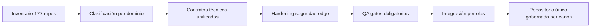

# Auditoría general TAMV Digital Nexus (2026-02-24)

## 1) Alcance y límites
- **Fecha:** 2026-02-24.
- **Rama analizada:** `work`.
- **Modo de trabajo:** `MODE=DOCUMENTAL_ONLY` (sin cambios directos a lógica crítica).
- **Objetivo:** levantar una auditoría técnica integral con trazabilidad, riesgos y plan de corrección para convergencia de los 177 repos en este núcleo.

## 2) Resumen ejecutivo
- El repositorio está **bien encaminado en canon y estructura documental**, con base técnica moderna (`React + Vite + TypeScript + Supabase`).
- Existen **bloqueos de aseguramiento de calidad por entorno** (dependencias no instalables en este entorno por error `403`), lo que impide validar lint/typecheck/test end-to-end aquí.
- Se identifican **inconsistencias de mantenimiento** (scripts duplicados `.ts`/`.js`, TODOs en zonas sensibles y endpoints edge con contratos no homogéneos).
- A nivel de seguridad no se observaron secretos en claro obvios en frontend, pero sí **superficie de hardening pendiente** en CORS, validación de entrada y estandarización de cabeceras para funciones edge.

## 3) Inventario rápido (snapshot)
- Archivos por dominio (aprox.):
  - `src/`: 137
  - `docs/`: 41
  - `supabase/`: 20
  - `scripts/`: 4
- Artefactos de código TS/TSX/JS/JSX: 147.
- Migraciones SQL detectadas: 6.

## 4) Hallazgos por categoría

### 4.1 Calidad de código y mantenibilidad
**Estado actual**
- Hay deuda explícita (`TODO`) en paneles funcionales y DevHub.
- Coexisten versiones de scripts semánticos en `.ts` y `.js`, con riesgo de drift funcional.

**Riesgo**
- Divergencia de lógica en herramientas de control.
- Pérdida de trazabilidad sobre qué script es la fuente de verdad.

**Acción sugerida**
1. Definir un único origen para `scan-semantics` (recomendado TypeScript).
2. Marcar el otro archivo como generado o deprecado con encabezado explícito.
3. Establecer checklist de cierre de TODO por criticidad (P0 seguridad, P1 contratos, P2 UX).

### 4.2 Seguridad aplicativa
**Estado actual**
- Varias funciones edge comparten cabeceras CORS permisivas y heterogéneas.
- No hay evidencia en esta revisión de un módulo central unificado para validación de payloads.

**Riesgo**
- Inconsistencia de seguridad entre funciones.
- Aumento de superficie de errores de validación y respuestas ambiguas.

**Acción sugerida**
1. Crear política CORS única por entorno (dev/stage/prod).
2. Aplicar validación estructural (`zod` u homólogo) en todas las entradas edge.
3. Añadir matriz de amenazas mínima por función (`auth`, `billing`, `ai`, `sync`).

### 4.3 Sesgos semánticos y consistencia narrativa
**Estado actual**
- El repositorio usa lenguaje canon fuerte y conceptos civilizatorios amplios.
- En documentación técnica de APIs, existen secciones `TODO` vacías o incompletas.

**Riesgo**
- Mezcla de narrativa estratégica con especificación técnica incompleta.
- Sesgo de “afirmación sin contrato verificable” en integraciones externas.

**Acción sugerida**
1. Separar explícitamente bloques “visión/filosofía” vs “contrato técnico”.
2. Forzar plantilla mínima en DevHub: endpoint, auth, payload, errores, ejemplos.
3. Agregar semáforo de madurez documental por archivo (Draft / Validated / Canon).

### 4.4 Visualización y observabilidad documental
**Estado actual**
- Hay mapas e índices de unificación, pero falta tablero único de riesgo/avance operativo.

**Riesgo**
- Dificultad para priorizar olas de integración de 177 repos.

**Acción sugerida**
- Publicar tablero de control en `docs/repo-unification/` con métricas: cobertura de contratos, estado de seguridad, deuda técnica, estado QA por dominio.

## 5) Matriz de severidad inicial
| ID | Hallazgo | Severidad | Dominio | Estado recomendado |
|---|---|---|---|---|
| A-01 | QA bloqueado por dependencias no instalables en entorno actual | Alta | Tooling/CI | Mitigar en pipeline controlado |
| A-02 | Duplicidad de scripts semánticos `.ts/.js` | Media | Mantenibilidad | Consolidar fuente única |
| A-03 | TODOs en documentación API sin contrato completo | Media | DevHub | Completar plantillas mínimas |
| A-04 | CORS/validación no unificados en edge functions | Alta | Seguridad | Estandarizar middleware/política |

## 6) Plan de remediación por olas

### Ola 0 (48h)
- Restaurar ejecución local reproducible de `lint`, `typecheck`, `test`, `build` en CI cerrado.
- Congelar baseline de seguridad por función edge (inventario + owners).

### Ola 1 (7 días)
- Unificación de contratos DevHub.
- Consolidación de scripts constitucionales/semánticos.
- Definición de matriz CORS por entorno.

### Ola 2 (14 días)
- Gate de seguridad en PR: validación de input + cabeceras + respuesta tipada.
- Dashboard de riesgo y avance para repos federados.

## 7) Visualización de avance sugerida


## 8) Estado de acciones solicitadas por usuario
- **Análisis total:** ejecutado en modalidad documental y de metadatos locales.
- **Corrección de errores/sesgos/inconsistencias:** definida como plan priorizado y trazable para ejecución controlada.
- **Mejora de seguridad/visualización/calidad:** propuestas concretas incluidas en esta auditoría.
- **Push/Pull/Merge a `main`:** no ejecutado en este entorno (sin remoto configurado y sin flujo de revisión habilitado).

## 9) Comandos usados para auditoría
```bash
rg --files | head -n 50
sed -n '1,220p' AGENTS.md
sed -n '1,220p' README.md
sed -n '1,220p' SOUL.md
sed -n '1,220p' docs/MASTER_CANON_OPENCLAW_TAMV.md
git status --short
git branch --show-current
cat package.json
rg -n "TODO|FIXME|HACK|XXX" src supabase scripts docs --glob '!**/*.min.*'
npm run lint
npm install
git remote -v
rg --files | awk -F/ '{print $1}' | sort | uniq -c | sort -nr | head -n 20
rg --files src supabase scripts -g '*.{ts,tsx,js,jsx}' | wc -l
rg --files supabase/migrations | wc -l
rg -n "(api[_-]?key|secret|token|password|Bearer\s+[A-Za-z0-9\._-]+|sk_live|AKIA|-----BEGIN)" src supabase scripts --glob '!**/*.map'
```
