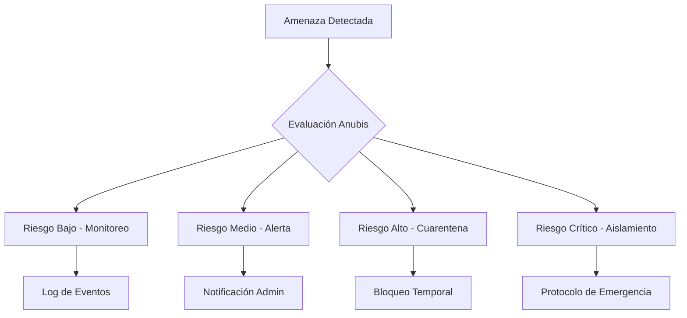

# Filosofía y Códices

## Marco Filosófico

TAMV MD-X4™ se fundamenta en principios filosóficos que fusionan la cosmovisión mesoamericana con la tecnología de vanguardia, creando un paradigma único de desarrollo digital.

### Los Tres Pilares

#### PODER (Tekpatl)
Representa la capacidad técnica y el dominio de la tecnología. El poder en TAMV no es dominación, sino **empoderamiento colectivo** a través de:
- Acceso democrático a herramientas avanzadas
- Transferencia de conocimiento técnico
- Autonomía tecnológica de las comunidades

#### LIDERAZGO (Tlacatecuhtli)
El liderazgo en TAMV se entiende como **servicio y guía**, inspirado en los líderes ancestrales que gobernaban para el bienestar colectivo:
- Toma de decisiones transparente
- Responsabilidad ante la comunidad
- Mentoría y desarrollo de nuevos líderes

#### MAGIA (Nahualli)
La transformación de lo imposible en posible a través de la tecnología:
- Experiencias inmersivas que trascienden la realidad
- IA que parece magia pero es ciencia
- Creación de mundos digitales significativos

## Códices Fundamentales

### Códice de Identidad (ID-NVIDA)

El sistema de identidad digital soberana que garantiza:

```typescript
interface IDNVIDIA {
  // Identidad autodeterminada
  selfSovereign: boolean;
  
  // Validación biométrica opcional
  biometricValidation: 'optional' | 'required';
  
  // Control de datos personales
  dataOwnership: 'user';
  
  // Reputación EOCT
  reputation: EOCTScore;
}
```

Principios del ID-NVIDA:
1. **Autodeterminación**: El usuario controla su identidad
2. **Portabilidad**: La identidad viaja entre sistemas
3. **Privacidad**: Datos mínimos necesarios
4. **Verificabilidad**: Validación sin exposición

### Códice de Gobernanza (CITEMESH)

El sistema de gobernanza democrática implementado:

| Nivel | Participación | Peso |
|-------|--------------|------|
| Observador | Voz sin voto | 0 |
| Ciudadano | Voto simple | 1 |
| Contribuidor | Voto ponderado | 2 |
| Guardián | Veto temporal | 3 |
| Fundador | Voto de calidad | 5 |

### Códice de Economía (MSR)

La **Moneda Soberana de la República** (MSR) como base del sistema económico:

- **TCEP (Token de Certificación Educacional Permanente)**: Certificaciones académicas
- **TAU (Token de Acceso Universal)**: Acceso a servicios y contenido
- **Conversión controlada**: Mecanismos de intercambio regulados

### Códice de Seguridad (DEKATEOTL)

El sistema de seguridad post-cuántica:



## Guardianías y Radares

### Sistema de Guardianías

TAMV implementa un sistema de "radares" de seguridad inspirados en la mitología egipcia y mesoamericana:

| Guardián | Función | Dominio |
|----------|---------|---------|
| **Anubis** | Seguridad y autenticación | Acceso y permisos |
| **Horus** | Vigilancia de red | Detección de intrusiones |
| **Osiris** | Recuperación y resurrección | Backup y restore |
| **Dekateotl** | Amenazas avanzadas | Criptografía cuántica |
| **Quetzalcóatl** | Sabiduría y conocimiento | IA y aprendizaje |
| **Tenochtitlan** | Infraestructura | Servicios base |

### EOCT (Evaluación de Observadores Confiables)

Sistema de reputación basado en múltiples factores:

```typescript
interface EOCTScore {
  // Puntuación base (0-100)
  base: number;
  
  // Factores contribuyentes
  factors: {
    antiguedad: number;      // Tiempo en el sistema
    contribuciones: number;  // Aportes al ecosistema
    reputacion: number;      // Valoración de pares
    verificaciones: number;  // Validaciones completadas
    certificaciones: number; // Cursos completados
  };
  
  // Nivel resultante
  level: 1 | 2 | 3 | 4 | 5;
}
```

## Ética de la IA

### Principios Isabella AI

La asistente IA emocional de TAMV sigue estos principios:

1. **Transparencia**: Siempre identifica su naturaleza de IA
2. **Beneficencia**: Actúa en beneficio del usuario
3. **No-maleficencia**: No causa daño intencional
4. **Autonomía**: Respeta las decisiones del usuario
5. **Justicia**: Trata a todos equitativamente

### Uso de BCI (TBENA)

El sistema de interfaz cerebro-computadora sigue protocolos estrictos:

- **Consentimiento informado**: Requerido antes de activación
- **Datos locales**: Procesamiento en dispositivo cuando posible
- **Olvido derecho**: El usuario puede eliminar sus datos
- **Explicabilidad**: El usuario puede entender las inferencias

## Soporte Humanitario

TAMV mantiene commitment con causas humanitarias:

- **Crisis Response**: Protocolos de respuesta ante emergencias
- **Accesibilidad**: Diseño universal para todos
- **Educación gratuita**: Cursos básicos sin costo
- **Comunidades marginadas**: Programas de inclusión digital

---

*Próxima sección: [Arquitectura General](./03-arquitectura)*
