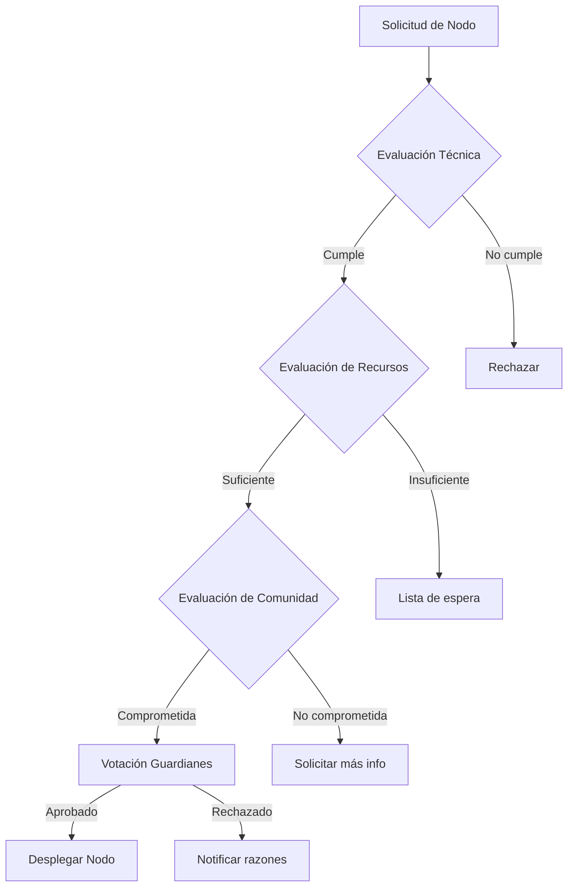
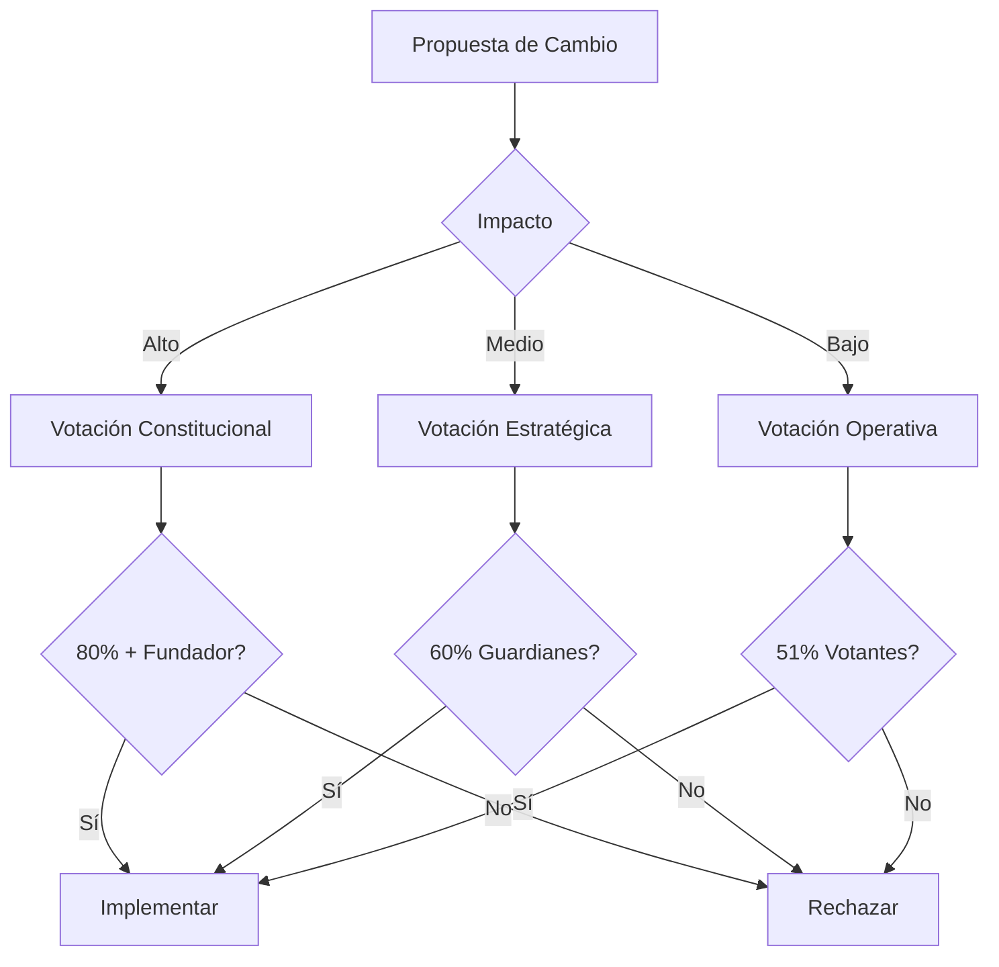

# Gobernanza TAMV

## Visión General

La gobernanza de TAMV MD-X4™ establece los mecanismos de toma de decisiones, asignación de roles, y procesos democráticos que garantizan la operación transparente y participativa del ecosistema.

## Sistema CITEMESH

### Concepto

CITEMESH (Consejo Interinstitucional de Tecnologías Emergentes para Metaversos y Ecosistemas de Salud) es el órgano de gobernanza principal de TAMV.

### Estructura

```
┌─────────────────────────────────────────────────────────────┐
│                    CITEMESH GENERAL                         │
│            (Máxima autoridad - Votación universal)          │
├─────────────────────────────────────────────────────────────┤
│                                                             │
│  ┌─────────────┐  ┌─────────────┐  ┌─────────────┐         │
│  │  Comisión   │  │  Comisión   │  │  Comisión   │         │
│  │  Técnica    │  │  Económica  │  │  Ética      │         │
│  └─────────────┘  └─────────────┘  └─────────────┘         │
│                                                             │
│  ┌─────────────┐  ┌─────────────┐  ┌─────────────┐         │
│  │  Comisión   │  │  Comisión   │  │  Comisión   │         │
│  │  Educativa  │  │  Seguridad  │  │  Legal      │         │
│  └─────────────┘  └─────────────┘  └─────────────┘         │
│                                                             │
├─────────────────────────────────────────────────────────────┤
│                     GUARDIANES                               │
│         (Ejecutores de decisiones - Nivel 5 EOCT)           │
├─────────────────────────────────────────────────────────────┤
│                     CIUDADANOS                               │
│              (Participantes con voto - Nivel 2+ EOCT)       │
└─────────────────────────────────────────────────────────────┘
```

---

## Roles y Responsabilidades

### 1. Fundador

```typescript
interface FounderRole {
  // Permisos especiales
  permissions: {
    veto: boolean;              // Veto sobre decisiones críticas
    emergencyAction: boolean;   // Acciones de emergencia
    constitutional: boolean;    // Modificaciones constitucionales
  };
  
  // Responsabilidades
  responsibilities: [
    'Visión estratégica del proyecto',
    'Resolución de conflictos mayores',
    'Representación institucional',
    'Garantía de valores fundacionales'
  ];
  
  // Elección: Heredero designado o votación unánime de guardianes
  succession: 'designated' | 'unanimity';
}
```

### 2. Guardián (Nivel 5 EOCT)

```typescript
interface GuardianRole {
  // Requisitos
  requirements: {
    eoctLevel: 5;
    contributions: number;      // Mínimo 100 contribuciones
    endorsements: number;       // Mínimo 10 avales de otros guardianes
    certifications: string[];   // Certificaciones requeridas
  };
  
  // Permisos
  permissions: {
    vote: 'weighted';           // Voto ponderado x3
    proposal: true;             // Proponer iniciativas
    veto: 'temporal';           // Veto temporal (7 días)
    admin: true;                // Funciones administrativas
    federation: true;           // Gestión de federación
  };
  
  // Responsabilidades
  responsibilities: [
    'Moderación de la comunidad',
    'Implementación de decisiones',
    'Mentoría a nuevos miembros',
    'Gestión de nodos federados',
    'Respuesta a emergencias'
  ];
}
```

### 3. Contribuidor (Nivel 3-4 EOCT)

```typescript
interface ContributorRole {
  // Requisitos
  requirements: {
    eoctLevel: [3, 4];
    activeMonths: 6;            // Mínimo 6 meses activo
  };
  
  // Permisos
  permissions: {
    vote: 'weighted';           // Voto ponderado x2
    proposal: true;             // Proponer iniciativas
    createContent: true;        // Crear contenido verificado
    courses: 'instructor';      // Ser instructor
  };
  
  // Responsabilidades
  responsibilities: [
    'Crear contenido de valor',
    'Participar en votaciones',
    'Reportar problemas',
    'Ayudar a nuevos usuarios'
  ];
}
```

### 4. Ciudadano (Nivel 2 EOCT)

```typescript
interface CitizenRole {
  // Requisitos
  requirements: {
    eoctLevel: 2;
    verifiedIdentity: true;
  };
  
  // Permisos
  permissions: {
    vote: 'simple';             // Voto simple
    proposal: 'limited';        // Propuestas limitadas
    courses: 'access';          // Acceso a cursos
    wallet: true;               // Wallet completa
  };
}
```

### 5. Observador (Nivel 1 EOCT)

```typescript
interface ObserverRole {
  // Requisitos
  requirements: {
    eoctLevel: 1;
    emailVerified: true;
  };
  
  // Permisos
  permissions: {
    vote: 'none';               // Sin voto
    proposal: false;            // Sin propuestas
    courses: 'free';            // Solo cursos gratuitos
    wallet: 'basic';            // Wallet básica
  };
}
```

---

## Procesos de Decisión

### Tipos de Decisiones

| Tipo | Descripción | Aprobación |
|------|-------------|------------|
| **Constitucional** | Cambios a reglas fundamentales | 80% + fundador |
| **Estratégica** | Dirección del proyecto | 60% guardianes |
| **Operativa** | Funcionamiento diario | 51% votantes |
| **Administrativa** | Gestión rutinaria | Guardián a cargo |

### Flujo de Propuestas

```
┌─────────────┐     ┌─────────────┐     ┌─────────────┐
│  PROPUESTA  │────▶│   REVISIÓN  │────▶│ DISCUSIÓN   │
│             │     │   (7 días)  │     │  (14 días)  │
└─────────────┘     └─────────────┘     └─────────────┘
                                              │
                                              ▼
┌─────────────┐     ┌─────────────┐     ┌─────────────┐
│ EJECUCIÓN   │◀────│  APROBADA   │◀────│  VOTACIÓN   │
│             │     │             │     │   (7 días)  │
└─────────────┘     └─────────────┘     └─────────────┘
       │
       ▼
┌─────────────┐
│  SEGUIMIENTO│
│   (30 días) │
└─────────────┘
```

### Implementación de Votación

```typescript
interface Proposal {
  id: string;
  title: string;
  description: string;
  type: 'constitutional' | 'strategic' | 'operational' | 'administrative';
  author: UserId;
  status: 'draft' | 'review' | 'discussion' | 'voting' | 'approved' | 'rejected' | 'executed';
  
  // Votación
  voting: {
    startDate: Date;
    endDate: Date;
    quorum: number;            // Porcentaje mínimo de participación
    threshold: number;         // Porcentaje para aprobar
    
    votes: {
      userId: string;
      vote: 'for' | 'against' | 'abstain';
      weight: number;          // Basado en rol
      timestamp: Date;
    }[];
  };
  
  // Resultado
  result?: {
    totalVotes: number;
    participation: number;
    for: number;
    against: number;
    abstain: number;
    approved: boolean;
  };
}

class VotingSystem {
  calculateResult(proposal: Proposal): VoteResult {
    const totalWeight = proposal.voting.votes.reduce((sum, v) => sum + v.weight, 0);
    const forWeight = proposal.voting.votes
      .filter(v => v.vote === 'for')
      .reduce((sum, v) => sum + v.weight, 0);
    
    const participation = proposal.voting.votes.length / this.getTotalVoters();
    const approvalRate = forWeight / totalWeight;
    
    return {
      participation,
      approvalRate,
      approved: participation >= proposal.voting.quorum && 
                approvalRate >= proposal.voting.threshold / 100,
      quorumMet: participation >= proposal.voting.quorum
    };
  }
}
```

---

## Mapas de Decisión

### Decisión: Nuevo Nodo Federado



### Decisión: Cambio de Protocolo



---

## Certificación Federada

### Proceso de Certificación

```typescript
interface FederationCertification {
  // Niveles de certificación
  levels: {
    bronze: {
      requirements: ['SLA 95%', 'Uptime 30 días', 'Security audit básico'];
      benefits: ['Badge federado', 'API básica'];
    };
    silver: {
      requirements: ['SLA 99%', 'Uptime 90 días', 'Security audit completo'];
      benefits: ['Badge premium', 'API extendida', 'Soporte prioritario'];
    };
    gold: {
      requirements: ['SLA 99.9%', 'Uptime 180 días', 'Security audit avanzado', 'BCI ready'];
      benefits: ['Badge elite', 'API completa', 'Dedicado', 'Co-gobernanza'];
    };
    platinum: {
      requirements: ['SLA 99.99%', 'Uptime 365 días', 'Quantum security', 'Full compliance'];
      benefits: ['Badge supremo', 'API unlimited', 'SLA garantizado', 'Voto en CITEMESH'];
    };
  };
  
  // Auditoría
  audit: {
    frequency: 'quarterly';
    items: [
      'Security assessment',
      'Performance review',
      'Compliance check',
      'Community feedback'
    ];
  };
}
```

### Auditoría de Nodos

```typescript
class NodeAuditor {
  async auditNode(nodeId: string): Promise<AuditResult> {
    // 1. Verificar uptime
    const uptime = await this.checkUptime(nodeId);
    
    // 2. Evaluar rendimiento
    const performance = await this.runPerformanceTests(nodeId);
    
    // 3. Auditoría de seguridad
    const security = await this.securityAudit(nodeId);
    
    // 4. Verificar compliance
    const compliance = await this.checkCompliance(nodeId);
    
    // 5. Feedback de usuarios
    const feedback = await this.collectFeedback(nodeId);
    
    return {
      nodeId,
      timestamp: new Date(),
      uptime: uptime.percentage,
      performance: performance.score,
      security: security.grade,
      compliance: compliance.status,
      userSatisfaction: feedback.average,
      overall: this.calculateOverall({
        uptime, performance, security, compliance, feedback
      })
    };
  }
}
```

---

## Transparencia

### Reportes Públicos

| Reporte | Frecuencia | Contenido |
|---------|------------|-----------|
| Estado del Sistema | Tiempo real | Métricas operativas |
| Financiero | Mensual | Ingresos, gastos, tesorería |
| Gobernanza | Semanal | Propuestas, votaciones, decisiones |
| Seguridad | Trimestral | Incidentes, mejoras, compliance |
| Comunidad | Mensual | Crecimiento, engagement, feedback |

### Acceso a Información

```typescript
interface TransparencyAccess {
  // Por nivel de membresía
  access: {
    free: ['public_reports', 'community_stats'];
    starter: ['financial_summary', 'governance_basic'];
    pro: ['financial_detailed', 'governance_full'];
    business: ['internal_metrics', 'security_summary'];
    enterprise: ['full_access', 'audit_logs'];
  };
}
```

---

## Resolución de Conflictos

### Niveles de Escalamiento

1. **Mediación**: Diálogo directo entre partes (7 días)
2. **Arbitraje**: Intervención de guardián neutro (14 días)
3. **Tribunal**: Panel de 3 guardianes (30 días)
4. **CITEMESH**: Decisión final del consejo

### Proceso

```typescript
class ConflictResolution {
  async resolve(conflict: Conflict): Promise<Resolution> {
    // Fase 1: Mediación
    const mediation = await this.mediation(conflict);
    if (mediation.resolved) return mediation.resolution;
    
    // Fase 2: Arbitraje
    const arbitration = await this.arbitration(conflict);
    if (arbitration.resolved) return arbitration.resolution;
    
    // Fase 3: Tribunal
    const tribunal = await this.tribunal(conflict);
    if (tribunal.resolved) return tribunal.resolution;
    
    // Fase 4: CITEMESH
    return this.citemeshFinal(conflict);
  }
}
```

---

*Próxima sección: [Manuales](./10-manuales)*
