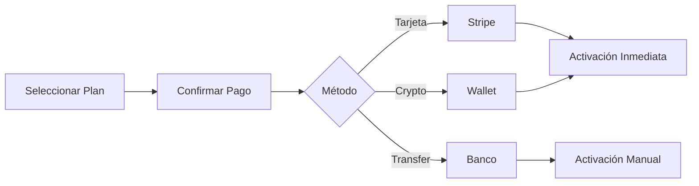

# Manuales TAMV

## Organización

Los manuales están organizados por rol y función, con navegación por tabs para facilitar el acceso a la información específica.

---

## Tab: Seguridad

### Manual de Seguridad para Usuarios

#### Conceptos Básicos

1. **Autenticación de Dos Factores (2FA)**
   - Habilitar 2FA en Configuración → Seguridad
   - Usar app autenticadora (Google Authenticator, Authy)
   - Guardar códigos de respaldo en lugar seguro

2. **Gestión de Contraseñas**
   - Mínimo 12 caracteres
   - Combinar mayúsculas, minúsculas, números, símbolos
   - No reutilizar contraseñas
   - Cambiar cada 90 días

3. **Sesiones Activas**
   - Revisar dispositivos conectados regularmente
   - Cerrar sesión en dispositivos no reconocidos
   - Habilitar notificaciones de nuevos inicios de sesión

#### Reporte de Incidentes

```typescript
// Procedimiento de reporte
const incidentReport = {
  pasos: [
    '1. Documentar evidencia (screenshots, logs)',
    '2. Contactar seguridad@tamv.network',
    '3. No compartir información públicamente',
    '4. Esperar confirmación de recepción',
    '5. Seguir instrucciones del equipo de seguridad'
  ],
  
  tiempos: {
    respuesta_inicial: '2 horas',
    investigacion: '24-72 horas',
    resolucion: '7 días máximo'
  }
};
```

### Manual de Seguridad para Administradores

#### Protocolos de Acceso

```yaml
acceso_admin:
  niveles:
    - nivel: operator
      permisos: [lectura, monitoreo]
      mfa: obligatorio
      
    - nivel: admin
      permisos: [escritura, configuracion]
      mfa: obligatorio
      aprobacion: true
      
    - nivel: superadmin
      permisos: [completo]
      mfa: obligatorio
      aprobacion: true
      logging: completo
```

#### Respuesta a Incidentes

| Severidad | Tiempo de Respuesta | Acción |
|-----------|---------------------|--------|
| Crítica (P1) | 15 minutos | Aislamiento inmediato |
| Alta (P2) | 1 hora | Mitigación activa |
| Media (P3) | 4 horas | Investigación |
| Baja (P4) | 24 horas | Documentación |

---

## Tab: Desarrollo

### Guía de Contribución

#### Configuración del Entorno

```bash
# Clonar repositorio
git clone https://github.com/tamv/digital-nexus.git
cd digital-nexus

# Instalar dependencias
bun install

# Configurar variables de entorno
cp .env.example .env

# Ejecutar en desarrollo
bun dev

# Ejecutar tests
bun test

# Linting
bun lint
```

#### Convenciones de Código

```typescript
// Nomenclatura
const VARIABLES_MAYUSCULAS = 'constantes';
const camelCase = 'variables y funciones';
const PascalCase = 'componentes y clases';
const kebab-case = 'archivos y directorios';

// Imports ordenados
import React from 'react';                    // 1. React/core
import { something } from 'external-lib';     // 2. Externos
import { Component } from '@/components';     // 3. Internos
import './styles.css';                        // 4. Estáticos

// Componentes
export const MyComponent: React.FC<Props> = ({ prop1, prop2 }) => {
  // Hooks al inicio
  const [state, setState] = useState();
  
  // Efectos
  useEffect(() => {}, []);
  
  // Handlers
  const handleClick = () => {};
  
  // Render
  return (
    <div className="my-component">
      {/* JSX */}
    </div>
  );
};
```

#### Estructura de Commits

```
tipo(ámbito): descripción corta

[cuerpo opcional]

[footer opcional]

Tipos:
- feat: Nueva funcionalidad
- fix: Corrección de bug
- docs: Documentación
- style: Formato
- refactor: Refactorización
- test: Tests
- chore: Tareas de mantenimiento

Ejemplo:
feat(membership): add tier validation to dashboard

- Implement validateTier() function
- Add unit tests for all tiers
- Update documentation

Closes #123
```

### API Reference

#### Autenticación

```typescript
// Login
POST /api/auth/login
{
  "email": "user@tamv.network",
  "password": "securePassword123"
}

Response:
{
  "token": "eyJ...",
  "user": { ... },
  "expiresAt": "2024-..."
}

// Verificar token
GET /api/auth/verify
Headers: { "Authorization": "Bearer eyJ..." }
```

#### Membresías

```typescript
// Obtener tier actual
GET /api/membership/current

// Actualizar membresía
POST /api/membership/upgrade
{
  "tier": "pro",
  "paymentMethodId": "pm_..."
}
```

#### BCI

```typescript
// Enviar datos EEG
POST /api/bci/emotion
{
  "sessionId": "session-123",
  "data": {
    "timestamp": 1234567890,
    "channels": {
      "F3": [0.1, 0.2, ...],
      "F4": [0.15, 0.25, ...],
      // ...
    }
  }
}

Response:
{
  "emotion": "calm",
  "confidence": 0.87,
  "modulation": {
    "environment": { ... },
    "agent": { ... }
  }
}
```

---

## Tab: Redundancia

### Backup y Recuperación

#### Estrategia de Backup

```yaml
backup_strategy:
  niveles:
    - nombre: hot_backup
      frecuencia: cada hora
      retencion: 24 horas
      ubicacion: mismo datacenter
      
    - nombre: daily_backup
      frecuencia: diario
      retencion: 30 días
      ubicacion: datacenter secundario
      
    - nombre: archive_backup
      frecuencia: semanal
      retencion: 1 año
      ubicacion: almacenamiento frío
```

#### Procedimiento de Recuperación

```bash
# 1. Identificar tipo de fallo
# 2. Seleccionar backup apropiado
# 3. Restaurar base de datos
docker-compose exec postgres pg_restore -U tamv -d tamv /backup/latest.dump

# 4. Verificar integridad
npm run db:verify

# 5. Restaurar servicios
docker-compose restart app

# 6. Validar funcionamiento
npm run health-check
```

### Alta Disponibilidad

#### Configuración de Réplicas

```yaml
# PostgreSQL con réplicas
postgres:
  primary:
    host: postgres-primary
    port: 5432
    
  replicas:
    - host: postgres-replica-1
      port: 5432
      mode: sync
      
    - host: postgres-replica-2
      port: 5432
      mode: async

# Redis con sentinel
redis:
  master: redis-master
  sentinels:
    - sentinel-1:26379
    - sentinel-2:26379
    - sentinel-3:26379
```

#### Failover Automático

```typescript
const failoverConfig = {
  checks: {
    interval: 5000,          // Cada 5 segundos
    timeout: 3000,           // Timeout de 3 segundos
    threshold: 3             // 3 fallos para trigger
  },
  
  actions: {
    database: 'switch_to_replica',
    cache: 'promote_replica',
    app: 'restart_unhealthy'
  },
  
  notifications: {
    slack: '#alerts',
    email: 'oncall@tamv.network'
  }
};
```

---

## Tab: FAQ

### Preguntas Frecuentes

#### Generales

**¿Qué es TAMV MD-X4™?**
> TAMV es un ecosistema civilizatorio digital latinoamericano que integra metaverso, IA, economía digital y educación en una plataforma unificada.

**¿Cómo puedo unirme?**
> Visita tamv.network, crea una cuenta gratuita y comienza a explorar. Puedes actualizar tu membresía en cualquier momento.

**¿Es TAMV open source?**
> El core de TAMV es open source bajo licencia MIT. Algunos componentes enterprise tienen licencia comercial.

#### Membresías

**¿Qué incluido en el plan Free?**
> Acceso básico al metaverso, cursos gratuitos, wallet básica, y participación limitada en la comunidad.

**¿Puedo cambiar de plan?**
> Sí, puedes actualizar o degradar tu plan en cualquier momento. Los cambios de upgrade son inmediatos, los de downgrade aplican al siguiente ciclo.

**¿Hay descuentos para empresas?**
> Sí, los planes Enterprise y Custom incluyen descuentos por volumen y características personalizadas. Contacta a ventas@tamv.network.

#### Técnico

**¿Qué navegadores son compatibles?**
> Chrome 90+, Firefox 88+, Safari 14+, Edge 90+. Para VR, usa navegadores compatibles con WebXR.

**¿Requisitos de hardware?**
> - Mínimo: 4GB RAM, GPU con WebGL
> - Recomendado: 8GB+ RAM, GPU dedicada
> - VR: GPU compatible con VR, 16GB+ RAM

**¿Cómo conecto dispositivos BCI?**
> Los dispositivos BCI compatibles (Muse, Emotiv, etc.) se conectan vía Bluetooth. La app TAMV detecta automáticamente dispositivos disponibles.

#### Seguridad

**¿Cómo protegen mis datos?**
> Encriptación end-to-end, almacenamiento en infraestructura SOC2, y auditorías de seguridad trimestrales.

**¿Quién tiene acceso a mis datos BCI?**
> Solo tú. Los datos BCI se procesan localmente cuando es posible. Los datos enviados a la nube están encriptados y anonimizados.

**¿Puedo eliminar mi cuenta?**
> Sí, en Configuración → Cuenta → Eliminar cuenta. Tienes 30 días para revertir la decisión antes de la eliminación permanente.

---

## Tab: Membresías

### Comparativa de Planes

| Característica | Free | Starter | Pro | Business | Enterprise |
|----------------|------|---------|-----|----------|------------|
| **Precio/mes** | $0 | $30 | $180 | $550+ | $2,400+ |
| **Usuarios** | 1 | 1-5 | 1-20 | 1-100 | Ilimitado |
| **API Calls/día** | 100 | 1,000 | 10,000 | 100,000 | Ilimitado |
| **Nodos Visibles** | 0 | 10 | 25 | 48 | 48+ |
| **Soporte** | Email | Email | Chat | Prioritario | Dedicado |
| **SLA** | - | - | 99% | 99.9% | 99.99% |
| **Dashboards** | Básico | Estándar | Avanzado | Completo | Custom |
| **Certificaciones** | 1 | 5 | 20 | 100 | Ilimitado |
| **BCI Features** | - | - | Básico | Avanzado | Completo |
| **White Label** | - | - | - | - | ✓ |

### Beneficios por Tier

#### Free ($0)
- Acceso a Dream Spaces públicos
- Cursos introductorios gratuitos
- Wallet básica con TAU limitados
- Participación en foros públicos
- 1 certificación gratuita

#### Starter ($30/mes)
- Todo de Free, más:
- 5 cursos premium incluidos
- API básica para integraciones
- Mayor capacidad de wallet
- Grupos privados

#### Pro ($180/mes)
- Todo de Starter, más:
- Acceso completo a cursos
- APIs extendidas
- Dashboard de métricas
- BCI básico
- 20 certificaciones/mes

#### Business ($550+/mes)
- Todo de Pro, más:
- Soporte prioritario 24/7
- SLA garantizado 99.9%
- Dashboard completo
- BCI avanzado
- Multi-usuario

#### Enterprise ($2,400+/mes)
- Todo de Business, más:
- Infraestructura dedicada
- SLA 99.99%
- BCI completo con TBENA
- Cumplimiento regulatorio
- Integraciones custom

#### Custom ($10,000+/mes)
- Todo de Enterprise, más:
- White-label disponible
- On-premise option
- Features a medida
- Soporte dedicado
- Gobernanza participativa

### Proceso de Upgrade



---

*Próxima sección: [Biografía CEO](./11-biografia-ceo)*
