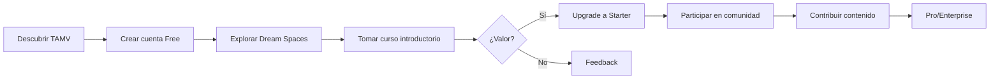
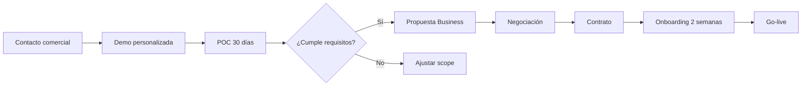
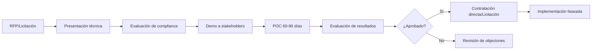

# Estrategia TAMV

## Visión Estratégica

TAMV MD-X4™ se posiciona como la plataforma de ecosistema civilizatorio digital líder en Latinoamérica, ofreciendo infraestructura soberana, tecnología de vanguardia y comunidad activa.

---

## Posicionamiento

### Propuesta de Valor Única

```
┌──────────────────────────────────────────────────────────────┐
│                                                              │
│   "La única plataforma digital soberana diseñada            │
│    por y para latinoamericanos, que integra metaverso,       │
│    IA emocional, economía digital y educación certificada   │
│    en un ecosistema unificado."                              │
│                                                              │
└──────────────────────────────────────────────────────────────┘
```

### Diferenciadores

| Diferenciador | Descripción |
|---------------|-------------|
| **Origen LATAM** | Diseñado desde y para Latinoamérica |
| **Soberanía** | Infraestructura y datos en la región |
| **Integración** | 177 sistemas en una plataforma |
| **BCI/IA** | Tecnología no disponible en otros |
| **Comunidad** | Red activa de contribuidores |
| **Open Source** | Core abierto y transparente |

### Análisis Competitivo

| Competidor | Fortalezas | Debilidades | Nuestra Ventaja |
|------------|------------|-------------|-----------------|
| Meta | Recursos, usuarios | Cerrado, extranjero | Abierto, LATAM |
| Decentraland | Web3, propiedad | Limitado, complejo | UX amigable |
| Roblox | Usuarios, creadores | Gaming-focused | Propósito general |
| Microsoft Mesh | Enterprise, integración | Caro, complejo | Accesible |
| **TAMV** | **Integrado, soberano, BCI** | **Nuevo** | **Diferenciación** |

---

## Segmentos de Mercado

### Segmentación

```
                    ┌─────────────────────────────────┐
                    │         SEGMENTOS TAMV          │
                    └─────────────────────────────────┘
                                   │
        ┌──────────────────────────┼──────────────────────────┐
        │                          │                          │
        ▼                          ▼                          ▼
┌───────────────┐         ┌───────────────┐         ┌───────────────┐
│    B2C        │         │    B2B        │         │    B2G        │
│  Consumidor   │         │   Empresa     │         │  Gobierno     │
├───────────────┤         ├───────────────┤         ├───────────────┤
│ • Individuos  │         │ • PyMEs       │         │ • Municipal   │
│ • Creadores   │         │ • Corporativos│         │ • Estatal     │
│ • Estudiantes │         │ • Startups    │         │ • Federal     │
│ • Profesionales│        │ • Agencias    │         │ • Internacional│
└───────────────┘         └───────────────┘         └───────────────┘
        │                          │                          │
        ▼                          ▼                          ▼
┌───────────────┐         ┌───────────────┐         ┌───────────────┐
│ Tier: Free-   │         │ Tier: Business│         │ Tier: Enterprise│
│ Pro           │         │ -Enterprise   │         │ -Custom        │
└───────────────┘         └───────────────┘         └───────────────┘
```

### Personas

#### Persona 1: María la Creadora
```yaml
perfil:
  nombre: María García
  edad: 28
  ocupacion: Diseñadora UX / Creadora de contenido
  ubicacion: Bogotá, Colombia
  
necesidades:
  - Herramientas para crear experiencias 3D
  - Comunidad de otros creadores
  - Monetización de contenido
  
frustraciones:
  - Plataformas actuales no entienden contexto LATAM
  - Difícil monetizar con divisas locales
  
solucion_tamv:
  tier: Pro ($180/mes)
  features:
    - Dream Space studio
    - Marketplace de assets
    - Comunidad de creadores
    - Wallet con TAU
```

#### Persona 2: Carlos el Empresario
```yaml
perfil:
  nombre: Carlos Mendoza
  edad: 45
  ocupacion: CEO de PyME tecnológica
  ubicacion: Ciudad de México
  
necesidades:
  - Plataforma para colaboración remota
  - Capacitación de empleados
  - Presencia digital innovadora
  
frustraciones:
  - Herramientas costosas en dólares
  - Soporte en inglés únicamente
  
solucion_tamv:
  tier: Business ($550/mes)
  features:
    - Oficina virtual
    - Universidad corporativa
    - Soporte en español
    - Facturación local
```

#### Persona 3: Dirección de Innovación Pública
```yaml
perfil:
  nombre: Instituto de Innovación Digital
  tipo: Gobierno municipal
  ubicacion: São Paulo, Brasil
  
necesidades:
  - Identidad digital ciudadana
  - Servicios públicos digitales
  - Participación ciudadana
  
frustraciones:
  - Dependencia de proveedores extranjeros
  - Datos en servidores fuera del país
  
solucion_tamv:
  tier: Enterprise ($2,400+/mes)
  features:
    - ID-NVIDA ciudadano
    - Nodo federado local
    - Datos en país
    - Cumplimiento regulatorio
```

---

## Propuesta de Valor por Segmento

### B2C (Consumidor)

| Propuesta | Beneficio |
|-----------|-----------|
| **Experiencias inmersivas** | Dream Spaces únicos |
| **Comunidad** | Red de latinos con intereses similares |
| **Educación** | Cursos con certificación blockchain |
| **Economía** | Wallet y tokens |
| **IA personal** | Isabella como asistente personal |

### B2B (Empresa)

| Propuesta | Beneficio |
|-----------|-----------|
| **Colaboración** | Oficinas virtuales |
| **Capacitación** | Universidad corporativa |
| **Innovación** | Labs de desarrollo |
| **Costo-efectividad** | Precio en moneda local |
| **Soporte** | Atención en español/portugués |

### B2G (Gobierno)

| Propuesta | Beneficio |
|-----------|-----------|
| **Soberanía** | Datos en territorio nacional |
| **Identidad** | ID-NVIDA para ciudadanos |
| **Transparencia** | Gobernanza abierta |
| **Cumplimiento** | Adherencia a regulaciones locales |
| **Consultoría** | Acompañamiento en transformación digital |

---

## Rutas de Adopción

### Modelo de Adopción

```
        Conciencia → Interés → Evaluación → Prueba → Adopción → Lealtad
            │           │          │           │          │         │
            ▼           ▼          ▼           ▼          ▼         ▼
        ┌───────┐   ┌───────┐  ┌───────┐   ┌───────┐  ┌───────┐ ┌───────┐
        │Marketing│ │Contenido│ │Demo   │   │Free   │  │Onboard│ │Comunidad│
        │Social  │ │WikiTAMV│ │Webinar│   │Trial  │  │Support│ │Events  │
        │PR      │ │Casos   │ │POC    │   │Freemium│ │Training│ │Rewards │
        └───────┘   └───────┘  └───────┘   └───────┘  └───────┘ └───────┘
```

### Ruta B2C



### Ruta B2B



### Ruta B2G



---

## Estrategia de Precios

### Modelo SaaS

```yaml
pricing_model:
  type: "Tiered SaaS"
  
  tiers:
    free:
      price: $0
      strategy: "Freemium acquisition"
      conversion_target: "10% to Starter"
      
    starter:
      price: $30
      strategy: "Entry level"
      conversion_target: "20% to Pro"
      
    pro:
      price: $180
      strategy: "Power users"
      conversion_target: "5% to Business"
      
    business:
      price: "$550-800"
      strategy: "SMB market"
      conversion_target: "10% to Enterprise"
      
    enterprise:
      price: "$2,400-9,500"
      strategy: "Enterprise accounts"
      model: "Per-seat or unlimited"
      
    custom:
      price: "$10,000+"
      strategy: "Large enterprises/governments"
      model: "Negotiated"
```

### Descuentos y Promociones

| Tipo | Condición | Descuento |
|------|-----------|-----------|
| Anual | Pago anticipado | 20% |
| Startup | < 2 años, < 10 empleados | 50% |
| Académico | Instituciones educativas | 40% |
| Gobierno | Entidades públicas | 30% |
| Referido | Traer nuevo cliente | 1 mes gratis |
| Early Adopter | Primeros 100 clientes | 25% perpetuo |

---

## Go-to-Market

### Fase 1: Fundación (Meses 1-6)

```yaml
objetivos:
  - "Lanzar MVP con features core"
  - "Conseguir 1,000 usuarios Free"
  - "100 usuarios de pago"
  - "3 casos de éxito documentados"

acciones:
  - "Launch en Product Hunt"
  - "Campaña en redes sociales LATAM"
  - "Partnerships con universidades"
  - "Webinars semanales"
  
kpi:
  usuarios: 1,000
  mrr: $5,000
  nps: 40+
```

### Fase 2: Crecimiento (Meses 7-18)

```yaml
objetivos:
  - "10,000 usuarios activos"
  - "500 clientes de pago"
  - "$50K MRR"
  - "Expansión a 3 países adicionales"

acciones:
  - "Equipo de ventas B2B"
  - "Programa de partners"
  - "Contenido SEO/Content marketing"
  - "Eventos presenciales"
  
kpi:
  usuarios: 10,000
  mrr: $50,000
  nps: 50+
  paises: 4
```

### Fase 3: Escala (Meses 19-36)

```yaml
objetivos:
  - "100,000 usuarios activos"
  - "2,000 clientes de pago"
  - "$500K MRR"
  - "Presencia en 10 países"

acciones:
  - "Equipo internacional"
  - "Programa de resellers"
  - "Integraciones estratégicas"
  - "Certificaciones oficiales"
  
kpi:
  usuarios: 100,000
  mrr: $500,000
  nps: 60+
  paises: 10
```

---

## Métricas Clave

### KPIs Principales

| KPI | Definición | Target Año 1 |
|-----|------------|--------------|
| **MRR** | Monthly Recurring Revenue | $100K |
| **ARR** | Annual Recurring Revenue | $1.2M |
| **CAC** | Customer Acquisition Cost | <$50 (B2C), <$500 (B2B) |
| **LTV** | Lifetime Value | >$500 (B2C), >$10K (B2B) |
| **LTV/CAC** | Ratio LTV to CAC | >3 |
| **Churn** | Tasa de cancelación | <5% mensual |
| **NPS** | Net Promoter Score | >50 |
| **ARPU** | Average Revenue Per User | $15 (B2C), $500 (B2B) |

### Dashboard Ejecutivo

```typescript
interface ExecutiveDashboard {
  // Finanzas
  finances: {
    mrr: number;
    arr: number;
    cac: number;
    ltv: number;
    arpu: number;
    burnRate: number;
    runway: number; // meses
  };
  
  // Usuarios
  users: {
    total: number;
    active: number;
    byTier: Map<Tier, number>;
    growth: number; // %
  };
  
  // Producto
  product: {
    dau: number;
    mau: number;
    retention: {
      d1: number;
      d7: number;
      d30: number;
    };
    nps: number;
  };
  
  // Operaciones
  operations: {
    uptime: number;
    incidents: number;
    responseTime: number;
    customerSatisfaction: number;
  };
}
```

---

## Conclusión

TAMV MD-X4™ está posicionado para liderar la transformación digital de Latinoamérica, ofreciendo una alternativa soberana, integrada y accesible a las plataformas extranjeras existentes. La estrategia de adopción gradual, segmentación clara, y propuesta de valor diferenciada permiten un crecimiento sostenible con impacto social positivo.

---

*Fin de WikiTAMV - Documentación completa del ecosistema TAMV MD-X4™*
